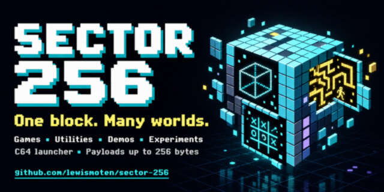

# Sector 256



**One block. Many worlds.** A graphical Commodore 64 launcher for games,
utilities, demos, and experiments whose individual stored payloads are at most
256 bytes.


[Browse the programs](programs/readme.md) · [Disk formats](docs/formats.md) ·
[Program interface](docs/program-api.md)

## Build and play

Install Python 3.10+ and **64tass**. On macOS, `brew install 64tass`; on
Debian/Ubuntu, `sudo apt install 64tass`. Then, from this directory:

```sh
python3 -m venv .venv
. .venv/bin/activate
python -m pip install -r requirements.txt
python scripts/build.py
python scripts/programs_md.py
```

The playable image is `release/sector-256.d64`. Attach it to drive 8 in VICE or
write it to a real 1541 disk. Load the first program:

```basic
LOAD"LOADER",8
RUN
```

## Releases

Pushing a semantic version tag in `vX.X.X` form builds and tests the project,
then creates a GitHub Release with `sector-256.d64` attached:

```sh
git tag v1.0.0
git push origin v1.0.0
```

* [Launcher](docs/launcher.md)
* [Program List](programs/readme.md)
* [Add a program](docs/add_program.md)
* [Disk organiation](docs/disk.md)


## Verify

After building:

```sh
python -m unittest discover -s tests -v
```

The tests execute the assembled 6502 code with deterministic KERNAL service
stubs. They cover win/loss/draw logic, repeated/invalid input, returning to the
launcher, categories, a 700-entry catalog, animation, D64 file chains, and the
oversize rejection/bypass. They supplement VICE; they are not cycle-accurate
hardware emulation. The included screenshots were rendered from executed
screen/bitmap RAM with C64 glyphs; ROM files and toolchain binaries are not
redistributed in this project.

## Layout

| Path | Purpose |
| --- | --- |
| `src/launcher.asm` | Graphical disk/catalog launcher |
| `src/api.inc` | Stable game entry and shared routine addresses |
| `programs/<category>/*/main.asm` | Individual program source, grouped by category |
| `scripts/build.py` | Compile, validate, pack, and build D64 |
| `scripts/d64.py` | Disk-image writer and verification reader |
| `scripts/programs_md.py` | Generate preview/source catalog |
| `tests/` | Machine-code and packaging verification |
| `build/manifest.json` | Generated sizes, offsets, flags, and pack assignments |
| `release/sector-256.d64` | Playable disk image |
