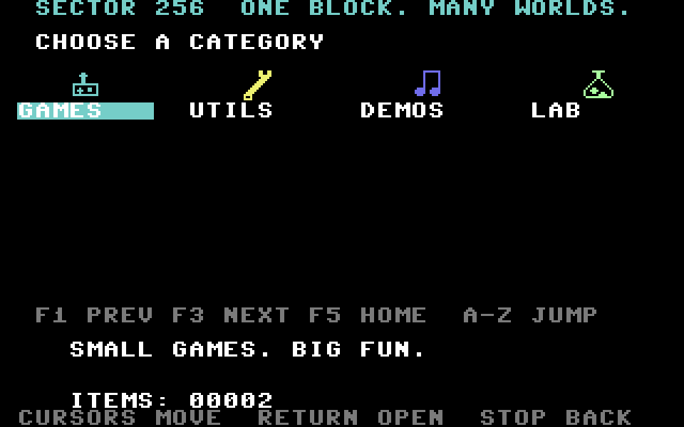
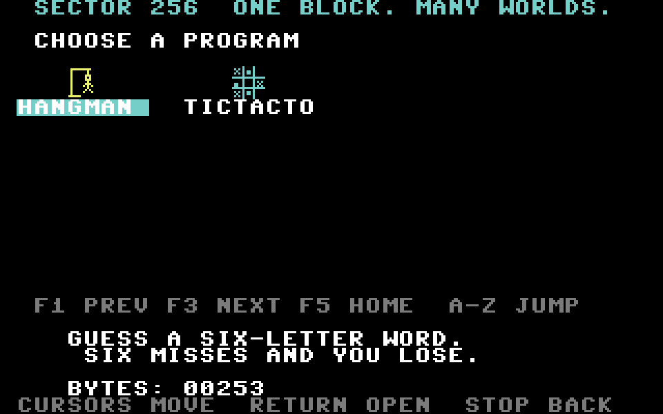

# Launcher

The launcher uses normal KERNAL disk I/O and
does not upload a custom fastloader to the drive.

## Controls

| Key | Launcher action |
| --- | --- |
| Cursor keys / shifted cursor keys | Move the selection |
| RETURN | Open a category or launch a program |
| F1 / F3 | Previous / next page of 12 programs |
| A–Z | Jump to the first program starting with that letter or a later letter |
| F5, DEL, or RUN/STOP | Return to the category page |
| RUN/STOP during a program | Return to the same launcher page |

The selected icon's name has a cyan background. Its 64-byte description and
payload size appear below the grid. An oversized entry has a red `!` beside its
name and a red `! OVER 256` label. Empty categories remain selectable.

[Home](../readme.md)