# ARCADE

FAST ACTION. QUICK REFLEXES. HIGH SCORES.

[All categories](../readme.md) · [Sector 256](../../README.md)

| Icon | Program | Description |
| --- | --- | --- |
|  | [BALLOON](#balloon) | PUMP WITH SPACE FOR POINTS. POP AND THE ROUND ENDS. |
|  | [BEAM](#beam) | A/D ROTATES THE TURRET. SPACE FIRES THE BEAM. |
|  | [BOUNCE](#bounce) | A/D SHIFTS THE BALL; SPACE LANDS ON THE PLATFORM. |
|  | [BRICKS](#bricks) | A/D MOVES THE PADDLE. SPACE SMASHES THE BRICK ROW. |
|  | [BUMPCAR](#bumpcar) | A/D STEERS THE CAR. SPACE RAMS THE OTHER CAR. |
|  | [CATCHER](#catcher) | A/D MOVE BASKET. CATCH STARS. THREE MISSES ENDS GAME. |
|  | [CAVE](#cave) | SPACE CLIMBS; RETURN FLIES THROUGH THE CAVE OPENING. |
|  | [COPTER](#copter) | SPACE CLIMBS; RETURN FLIES THROUGH THE CAVE OPENING. |
|  | [DOCKING](#docking) | A/D ADJUST VELOCITY; SPACE DOCKS AT THE TARGET. |
|  | [DODGE](#dodge) | A/D DODGE FALLING BLOCKS. SURVIVE FOR SCORE. |
|  | [ELEVATOR](#elevator) | A/D ADJUST VELOCITY; SPACE DOCKS AT THE TARGET. |
|  | [ESCAPE](#escape) | A/D MOVES THE RUNNER. SPACE ESCAPES THE ROBOT LANE. |
|  | [FALLDOWN](#falldown) | LINE UP WITH EACH RISING FLOOR GAP. A/D MOVE; SPACE FALLS. |
|  | [FIREMAN](#fireman) | A/D MOVES THE NET. SPACE CATCHES THE RANDOM JUMPER. |
|  | [FLIPPER](#flipper) | HIT A OR D FOR THE FLIPPER UNDER THE FALLING BALL. |
|  | [FLUTTER](#flutter) | SPACE FLAPS; RETURN FLIES THROUGH THE CAVE OPENING. |
|  | [INVADE](#invade) | A/D MOVES THE CANNON; SPACE ZAPS THE INVADER. |
|  | [JUGGLE](#juggle) | SPACE JUGGLES. RANDOM DROPS REDUCE YOUR THREE BALLS. |
|  | [JUMPER](#jumper) | CHARGE A JUMP WITH A, THEN SPACE OVER EACH WALL. |
|  | [LANDER](#lander) | FIRE A TO THRUST. KEEP DESCENT SPEED BELOW THREE. |
|  | [LAVA](#lava) | MOVE A/D BEFORE THE CURRENT TILE BURNS. KEEP RUNNING. |
|  | [PONG](#pong) | RETURN THE BALL WITH A ON LEFT OR D ON RIGHT. |
|  | [STACKER](#stacker) | TIME SPACE TO DROP A SLIDING BLOCK ON AN EVER-SMALLER STACK. |
|  | [ZAP](#zap) | Places a new random alien target on every key press. |

---

## BALLOON

PUMP WITH SPACE FOR POINTS. POP AND THE ROUND ENDS.

Stored payload: **181 bytes**.

[Assembly source](BALLOON/main.asm)

## BEAM

A/D ROTATES THE TURRET. SPACE FIRES THE BEAM.

Stored payload: **175 bytes**.

[Assembly source](BEAM/main.asm)

## BOUNCE

A/D SHIFTS THE BALL; SPACE LANDS ON THE PLATFORM.

Stored payload: **176 bytes**.

[Assembly source](BOUNCE/main.asm)

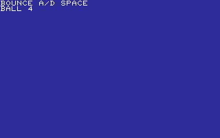

## BRICKS

A/D MOVES THE PADDLE. SPACE SMASHES THE BRICK ROW.

Stored payload: **216 bytes**.

[Assembly source](BRICKS/main.asm)

## BUMPCAR

A/D STEERS THE CAR. SPACE RAMS THE OTHER CAR.

Stored payload: **177 bytes**.

[Assembly source](BUMPCAR/main.asm)

## CATCHER

A/D MOVE BASKET. CATCH STARS. THREE MISSES ENDS GAME.

Stored payload: **241 bytes**.

[Assembly source](CATCHER/main.asm)

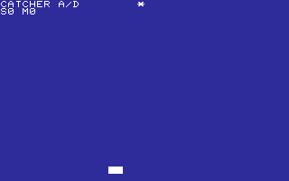

## CAVE

SPACE CLIMBS; RETURN FLIES THROUGH THE CAVE OPENING.

Stored payload: **174 bytes**.

[Assembly source](CAVE/main.asm)

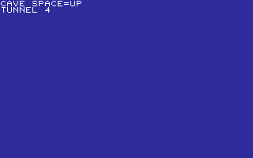

## COPTER

SPACE CLIMBS; RETURN FLIES THROUGH THE CAVE OPENING.

Stored payload: **172 bytes**.

[Assembly source](COPTER/main.asm)

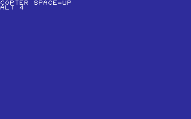

## DOCKING

A/D ADJUST VELOCITY; SPACE DOCKS AT THE TARGET.

Stored payload: **167 bytes**.

[Assembly source](DOCKING/main.asm)

## DODGE

A/D DODGE FALLING BLOCKS. SURVIVE FOR SCORE.

Stored payload: **208 bytes**.

[Assembly source](DODGE/main.asm)

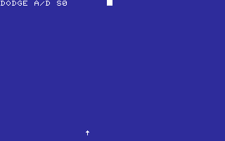

## ELEVATOR

A/D ADJUST VELOCITY; SPACE DOCKS AT THE TARGET.

Stored payload: **175 bytes**.

[Assembly source](ELEVATOR/main.asm)

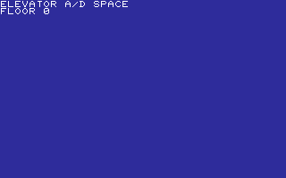

## ESCAPE

A/D MOVES THE RUNNER. SPACE ESCAPES THE ROBOT LANE.

Stored payload: **183 bytes**.

[Assembly source](ESCAPE/main.asm)

## FALLDOWN

LINE UP WITH EACH RISING FLOOR GAP. A/D MOVE; SPACE FALLS.

Stored payload: **198 bytes**.

[Assembly source](FALLDOWN/main.asm)

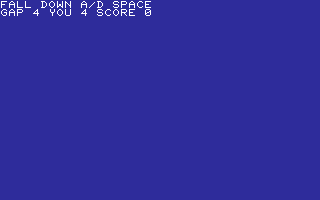

## FIREMAN

A/D MOVES THE NET. SPACE CATCHES THE RANDOM JUMPER.

Stored payload: **192 bytes**.

[Assembly source](FIREMAN/main.asm)

## FLIPPER

HIT A OR D FOR THE FLIPPER UNDER THE FALLING BALL.

Stored payload: **181 bytes**.

[Assembly source](FLIPPER/main.asm)

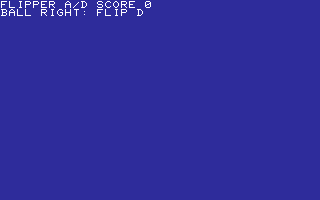

## FLUTTER

SPACE FLAPS; RETURN FLIES THROUGH THE CAVE OPENING.

Stored payload: **170 bytes**.

[Assembly source](FLUTTER/main.asm)

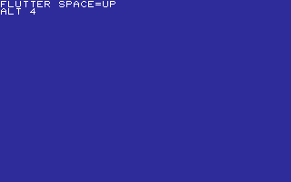

## INVADE

A/D MOVES THE CANNON; SPACE ZAPS THE INVADER.

Stored payload: **177 bytes**.

[Assembly source](INVADE/main.asm)

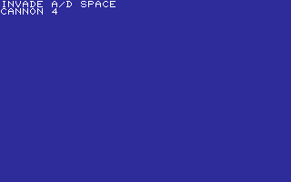

## JUGGLE

SPACE JUGGLES. RANDOM DROPS REDUCE YOUR THREE BALLS.

Stored payload: **134 bytes**.

[Assembly source](JUGGLE/main.asm)

## JUMPER

CHARGE A JUMP WITH A, THEN SPACE OVER EACH WALL.

Stored payload: **185 bytes**.

[Assembly source](JUMPER/main.asm)

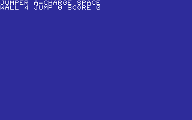

## LANDER

FIRE A TO THRUST. KEEP DESCENT SPEED BELOW THREE.

Stored payload: **178 bytes**.

[Assembly source](LANDER/main.asm)

## LAVA

MOVE A/D BEFORE THE CURRENT TILE BURNS. KEEP RUNNING.

Stored payload: **179 bytes**.

[Assembly source](LAVA/main.asm)

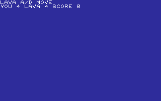

## PONG

RETURN THE BALL WITH A ON LEFT OR D ON RIGHT.

Stored payload: **187 bytes**.

[Assembly source](PONG/main.asm)

## STACKER

TIME SPACE TO DROP A SLIDING BLOCK ON AN EVER-SMALLER STACK.

Stored payload: **244 bytes**.

[Assembly source](STACKER/main.asm)

## ZAP

Places a new random alien target on every key press.

Stored payload: **76 bytes**.

[Assembly source](ZAP/main.asm)

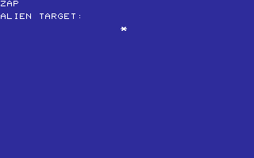

---
**24 programs · 4,346 bytes total · 1798 bytes to spare in this category**

Want to add one? See [Add a program](../../docs/add_program.md)
and the [program interface](../../docs/program-api.md).

Regenerate this page with `python scripts/programs_md.py`.