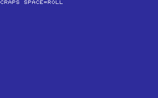
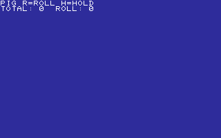

# CHANCE

ROLL, DEAL, PICK, AND PRESS YOUR LUCK.

[All categories](../readme.md) · [Sector 256](../../README.md)

| Icon | Program | Description |
| --- | --- | --- |
|  | [BLACKJCK](#blackjck) | DRAW OR STAND AGAINST A RANDOM DEALER TOTAL. |
|  | [CRAPS](#craps) | CRAPS: SPACE ROLLS. MAKE THE POINT BEFORE ROLLING SEVEN. |
|  | [DICE](#dice) | SPACE ROLLS TWO DICE WITH A QUICK TUMBLE. |
|  | [FIVEDICE](#fivedice) | ROLL FIVE DICE THREE TIMES. SIXES BUILD YOUR SCORE. |
|  | [HILO](#hilo) | HILO CARD GAME. H=HIGH, L=LOW. GUESS THE NEXT RANK. |
|  | [HOTPOT](#hotpot) | PASS THE KEYBOARD. A HIDDEN RANDOM FUSE GOES BOOM. |
|  | [LOTTO](#lotto) | PICK SIX 1-9 DIGITS, THEN MATCH THE RANDOM LOTTO DRAW. |
|  | [MONTY](#monty) | PICK 1-3. MONTY OPENS A GOAT. S:SWITCH K:KEEP. STOP:EXIT. |
|  | [PIG](#pig) | ROLL TOWARD NINE, OR HOLD BEFORE A ONE BUSTS. |
|  | [POKER](#poker) | SPACE DEALS A TINY FIVE-CARD POKER HAND. |
|  | [SLOTS](#slots) | THREE-REEL SLOTS. MATCH ALL THREE TO WIN. |

---

## BLACKJCK

DRAW OR STAND AGAINST A RANDOM DEALER TOTAL.

Stored payload: **248 bytes**.

[Assembly source](BLACKJCK/main.asm)

## CRAPS

CRAPS: SPACE ROLLS. MAKE THE POINT BEFORE ROLLING SEVEN.

Stored payload: **230 bytes**.

[Assembly source](CRAPS/main.asm)

## DICE

SPACE ROLLS TWO DICE WITH A QUICK TUMBLE.

Stored payload: **120 bytes**.

[Assembly source](DICE/main.asm)

## FIVEDICE

ROLL FIVE DICE THREE TIMES. SIXES BUILD YOUR SCORE.

Stored payload: **196 bytes**.

[Assembly source](FIVEDICE/main.asm)

## HILO

HILO CARD GAME. H=HIGH, L=LOW. GUESS THE NEXT RANK.

Stored payload: **217 bytes**.

[Assembly source](HILO/main.asm)

## HOTPOT

PASS THE KEYBOARD. A HIDDEN RANDOM FUSE GOES BOOM.

Stored payload: **162 bytes**.

[Assembly source](HOTPOT/main.asm)

## LOTTO

PICK SIX 1-9 DIGITS, THEN MATCH THE RANDOM LOTTO DRAW.

Stored payload: **177 bytes**.

[Assembly source](LOTTO/main.asm)

## MONTY

PICK 1-3. MONTY OPENS A GOAT. S:SWITCH K:KEEP. STOP:EXIT.

Stored payload: **256 bytes**.

[Assembly source](MONTY/main.asm)

## PIG

ROLL TOWARD NINE, OR HOLD BEFORE A ONE BUSTS.

Stored payload: **204 bytes**.

[Assembly source](PIG/main.asm)

## POKER

SPACE DEALS A TINY FIVE-CARD POKER HAND.

Stored payload: **183 bytes**.

[Assembly source](POKER/main.asm)

## SLOTS

THREE-REEL SLOTS. MATCH ALL THREE TO WIN.

Stored payload: **205 bytes**.

[Assembly source](SLOTS/main.asm)

---
**11 programs · 2,198 bytes total · 618 bytes to spare in this category**

Want to add one? See [Add a program](../../docs/add_program.md)
and the [program interface](../../docs/program-api.md).

Regenerate this page with `python scripts/programs_md.py`.