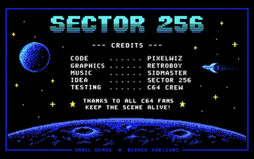
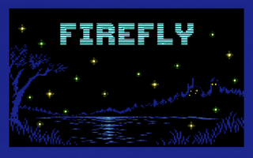
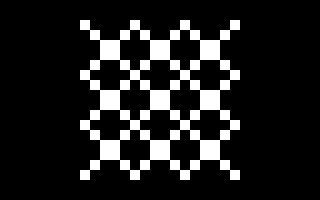
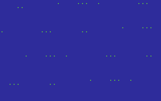
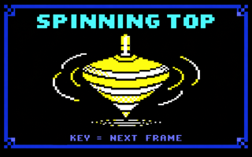
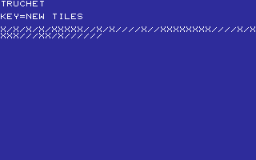
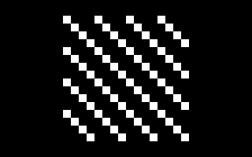

# DEMOS

PIXELS, SOUND AND TINY SHOWS.

[All categories](../readme.md) · [Sector 256](../../README.md)

| Icon | Program | Description |
| --- | --- | --- |
|  | [ATOM](#atom) | Cycles a single electron around a tiny character-mode atom. |
|  | [CANDLE](#candle) | SHOW A CHARACTER-ART CANDLE WITH RANDOM FLAME FRAMES. |
|  | [CITYLGT](#citylgt) | Randomizes a row of glowing windows beneath a tiny city skyline. |
|  | [CREDITS](#credits) | Alternates two compact character-mode credit pages. |
|  | [CUBE3D](#cube3d) | A ROTATING 3D WIREFRAME CUBE.   RUN/STOP TO RETURN TO LAUNCHER. |
|  | [DANCE](#dance) | DISCO LADY: FOUR VECTOR DANCE POSES. RUN/STOP TO RETURN. |
|  | [EQUALIZR](#equalizr) | RANDOM CHARACTER-MODE EQUALIZER BARS. |
|  | [FIREFLY](#firefly) | Scatters a fresh random field of blinking fireflies. |
|  | [GLITCH](#glitch) | Generates a new randomized character-corruption field. |
|  | [HEARTBT](#heartbt) | Alternates character-heart frames with a SID pulse. |
|  | [HEXFLOW](#hexflow) | Generates a fresh random field of hexadecimal digits. |
|  | [MARQUEE](#marquee) | A tiny character-mode chasing-light marquee. |
|  | [MAZE10](#maze10) | A CLASSIC RANDOM DIAGONAL CHARACTER MAZE. |
|  | [MUNCHING](#munching) | CLASSIC MUNCHING XOR SQUARES WITH A CHANGING PHASE. |
|  | [NEON](#neon) | Alternates bright and dim character-neon sign frames. |
|  | [OCEAN](#ocean) | Alternates two compact character-mode ocean wave scenes. |
|  | [RAIN](#rain) | REPAINT A SPARSE GREEN CHARACTER-RAIN FIELD. |
|  | [SCANNER](#scanner) | Steps a bright scanner marker across a character line. |
|  | [SNOW](#snow) | PIXEL SNOW: BRIGHT FLAKES FALL FAST AND STACK. RUN/STOP:EXIT. |
|  | [TRUCHET](#truchet) | Generates a fresh random field of diagonal character tiles. |
|  | [XORPAT](#xorpat) | A CLASSIC X-XOR-Y CHARACTER TEXTURE. |

---

## ATOM

Cycles a single electron around a tiny character-mode atom.

Stored payload: **76 bytes**.

[Assembly source](ATOM/main.asm)

## CANDLE

SHOW A CHARACTER-ART CANDLE WITH RANDOM FLAME FRAMES.

Stored payload: **253 bytes**.

[Assembly source](CANDLE/main.asm)

## CITYLGT

Randomizes a row of glowing windows beneath a tiny city skyline.

Stored payload: **106 bytes**.

[Assembly source](CITYLGT/main.asm)

## CREDITS

Alternates two compact character-mode credit pages.

Stored payload: **188 bytes**.

[Assembly source](CREDITS/main.asm)

## CUBE3D

A ROTATING 3D WIREFRAME CUBE.   RUN/STOP TO RETURN TO LAUNCHER.

Stored payload: **238 bytes**.

[Assembly source](CUBE3D/main.asm)

## DANCE

DISCO LADY: FOUR VECTOR DANCE POSES. RUN/STOP TO RETURN.

Stored payload: **249 bytes**.

[Assembly source](DANCE/main.asm)

## EQUALIZR

RANDOM CHARACTER-MODE EQUALIZER BARS.

Stored payload: **97 bytes**.

[Assembly source](EQUALIZR/main.asm)

## FIREFLY

Scatters a fresh random field of blinking fireflies.

Stored payload: **82 bytes**.

[Assembly source](FIREFLY/main.asm)

## GLITCH

Generates a new randomized character-corruption field.

Stored payload: **71 bytes**.

[Assembly source](GLITCH/main.asm)

## HEARTBT

Alternates character-heart frames with a SID pulse.

Stored payload: **189 bytes**.

[Assembly source](HEARTBT/main.asm)

## HEXFLOW

Generates a fresh random field of hexadecimal digits.

Stored payload: **93 bytes**.

[Assembly source](HEXFLOW/main.asm)

## MARQUEE

A tiny character-mode chasing-light marquee.

Stored payload: **137 bytes**.

[Assembly source](MARQUEE/main.asm)

## MAZE10

A CLASSIC RANDOM DIAGONAL CHARACTER MAZE.

Stored payload: **35 bytes**.

[Assembly source](MAZE10/main.asm)

## MUNCHING

CLASSIC MUNCHING XOR SQUARES WITH A CHANGING PHASE.

Stored payload: **49 bytes**.

[Assembly source](MUNCHING/main.asm)

## NEON

Alternates bright and dim character-neon sign frames.

Stored payload: **197 bytes**.

[Assembly source](NEON/main.asm)

## OCEAN

Alternates two compact character-mode ocean wave scenes.

Stored payload: **196 bytes**.

[Assembly source](OCEAN/main.asm)

## RAIN

REPAINT A SPARSE GREEN CHARACTER-RAIN FIELD.

Stored payload: **78 bytes**.

[Assembly source](RAIN/main.asm)

## SCANNER

Steps a bright scanner marker across a character line.

Stored payload: **81 bytes**.

[Assembly source](SCANNER/main.asm)

## SNOW

PIXEL SNOW: BRIGHT FLAKES FALL FAST AND STACK. RUN/STOP:EXIT.

Stored payload: **255 bytes**.

[Assembly source](SNOW/main.asm)

## TRUCHET

Generates a fresh random field of diagonal character tiles.

Stored payload: **79 bytes**.

[Assembly source](TRUCHET/main.asm)

## XORPAT

A CLASSIC X-XOR-Y CHARACTER TEXTURE.

Stored payload: **45 bytes**.

[Assembly source](XORPAT/main.asm)

---
**21 programs · 2,794 bytes total · 2582 bytes to spare in this category**

Want to add one? See [Add a program](../../docs/add_program.md)
and the [program interface](../../docs/program-api.md).

Regenerate this page with `python scripts/programs_md.py`.