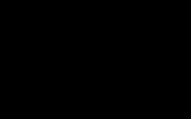

# EDU

SHORT LESSONS AND PRACTICE.

[All categories](../readme.md) · [Sector 256](../../README.md)

*  [ALPHABET](#alphabet)
*  [COLORS](#colors)
*  [COUNTING](#counting)
*  [QUIZ](#quiz)
*  [SPELLING](#spelling)

---

## ALPHABET

FIND THE NEXT LETTER IN THREE SHORT SEQUENCES.

Stored payload: **150 bytes**.

[Assembly source](ALPHABET/main.asm)

## COLORS

PRACTICE THE C64 COLOR NUMBERS FOR RED, BLUE, AND WHITE.

Stored payload: **176 bytes**.

[Assembly source](COLORS/main.asm)

## COUNTING

COUNT THE STARS AND ENTER THE NUMBER. THREE CORRECT WINS.

Stored payload: **151 bytes**.

[Assembly source](COUNTING/main.asm)

## QUIZ

ANSWER THREE SHORT ADDITION QUESTIONS.

Stored payload: **147 bytes**.

[Assembly source](QUIZ/main.asm)

## SPELLING

FILL IN MISSING LETTERS FOR THREE SHORT WORDS.

Stored payload: **144 bytes**.

[Assembly source](SPELLING/main.asm)

---
**5 programs · 768 bytes total · 512 bytes to spare in this category**

Want to add one? See [Add a program](../../docs/add_program.md)
and the [program interface](../../docs/program-api.md).

Regenerate this page with `python scripts/programs_md.py`.