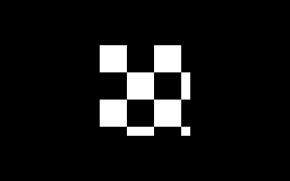
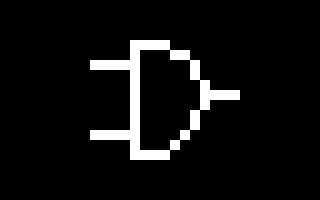
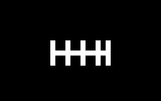
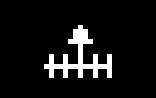
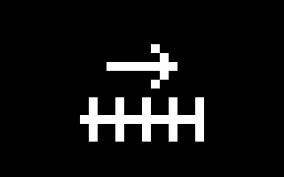
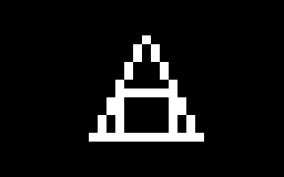

# EDU

SHORT LESSONS AND PRACTICE.

[All categories](../readme.md) · [Sector 256](../../README.md)

| Icon | Program | Description |
| --- | --- | --- |
|  | [ADDITION](#addition) | SOLVE THREE ONE-DIGIT ADDITION QUESTIONS. |
|  | [ALPHABET](#alphabet) | FIND THE NEXT LETTER IN THREE SHORT SEQUENCES. |
|  | [ANIMALS](#animals) | PICK THE FIRST LETTER OF THREE ANIMAL NAMES. |
|  | [BINQUIZ](#binquiz) | CONVERT FOUR SIMPLE BINARY VALUES TO DECIMAL. |
|  | [BITOPS](#bitops) | SOLVE FOUR ONE-BIT AND OR XOR OPERATIONS. |
|  | [BODY](#body) | PICK THE FIRST LETTER OF THREE BODY PARTS. |
|  | [CLOCK](#clock) | READ THREE SIMPLE ON-THE-HOUR CLOCK TIMES. |
|  | [COLORS](#colors) | PRACTICE THE C64 COLOR NUMBERS FOR RED, BLUE, AND WHITE. |
|  | [COMPASS](#compass) | NAME THE CARDINAL DIRECTION OF EACH ARROW. |
|  | [COUNTING](#counting) | COUNT THE STARS AND ENTER THE NUMBER. THREE CORRECT WINS. |
|  | [DAYS](#days) | PICK THE FIRST LETTER OF THREE WEEKDAY NAMES. |
|  | [DAYSWK](#dayswk) | TYPE THE FIRST LETTER OF THE NEXT WEEKDAY. |
|  | [DIVIDE](#divide) | SOLVE THREE SMALL DIVISION QUESTIONS. |
|  | [ESTIMATE](#estimate) | COUNT A BRIEFLY FLASHED GROUP OF DOTS. |
|  | [FAMILY](#family) | PICK THE FIRST LETTER OF THREE FAMILY WORDS. |
|  | [FOOD](#food) | PICK THE FIRST LETTER OF THREE FOOD WORDS. |
|  | [FRACTION](#fraction) | IDENTIFY THE TOP NUMBER IN THREE SIMPLE FRACTIONS. |
|  | [GRAPHPT](#graphpt) | READ A MARKED POINT ON A SMALL COORDINATE GRID. |
|  | [GREATER](#greater) | CHOOSE LESS-THAN OR GREATER-THAN FOR EACH PAIR. |
|  | [HEXQUIZ](#hexquiz) | CONVERT FOUR DECIMAL VALUES TO HEX DIGITS. |
|  | [HOME](#home) | PICK THE FIRST LETTER OF THREE HOUSEHOLD WORDS. |
|  | [JOBS](#jobs) | PICK THE FIRST LETTER OF THREE JOB WORDS. |
|  | [KEYFIND](#keyfind) | FIND AND PRESS EACH HIGHLIGHTED KEY. |
|  | [LANDMARK](#landmark) | PICK THE FIRST LETTER OF THREE LANDMARK WORDS. |
|  | [LOGIC](#logic) | TOGGLE TWO INPUTS AND VIEW THEIR AND-GATE OUTPUT. |
|  | [MAPS](#maps) | PRACTICE THE FIRST LETTERS OF COMPASS DIRECTIONS. |
|  | [MEASURE](#measure) | ESTIMATE BAR LENGTHS IN CHARACTER CELLS. |
|  | [MEMORY](#memory) | REPEAT THE THREE-NUMBER SEQUENCE FROM MEMORY. |
|  | [MONTHS](#months) | PICK THE FIRST LETTER OF THREE MONTH NAMES. |
|  | [MULTIPLY](#multiply) | SOLVE THREE SMALL MULTIPLICATION QUESTIONS. |
|  | [MUSIC](#music) | PICK THE FIRST LETTER OF THREE MUSIC WORDS. |
|  | [NATURE](#nature) | PICK THE FIRST LETTER OF THREE NATURE WORDS. |
|  | [NUMBERS](#numbers) | PICK THE FIRST LETTER OF THREE NUMBER NAMES. |
|  | [NUMLINE](#numline) | READ MARKED VALUES ON SIMPLE NUMBER LINES. |
|  | [OCEANLIF](#oceanlif) | PICK THE FIRST LETTER OF THREE SEA-LIFE WORDS. |
|  | [OCEANS](#oceans) | PICK THE FIRST LETTER OF THREE OCEAN NAMES. |
|  | [ODDEVEN](#oddeven) | MARK RANDOM NUMBERS ODD WITH O OR EVEN WITH E. |
|  | [OPPOSITE](#opposite) | PICK THE FIRST LETTER OF THREE OPPOSITE WORDS. |
|  | [PETSCIIQ](#petsciiq) | TYPE THE DECIMAL PETSCII CODES OF DISPLAYED LETTERS. |
|  | [PLANETS](#planets) | PICK THE NEXT INNER PLANET INITIAL IN ORDER. |
|  | [PLANTS](#plants) | PICK THE FIRST LETTER OF THREE PLANT WORDS. |
|  | [PLANTS2](#plants2) | PICK THE FIRST LETTER OF THREE MORE PLANT WORDS. |
|  | [PRIMEQZ](#primeqz) | DECIDE WHETHER FOUR NUMBERS ARE PRIME WITH Y OR N. |
|  | [QUIZ](#quiz) | ANSWER THREE SHORT ADDITION QUESTIONS. |
|  | [RHYMES](#rhymes) | PICK THE FIRST LETTER OF THREE SIMPLE RHYMING WORDS. |
|  | [ROUNDING](#rounding) | ROUND TWO-DIGIT NUMBERS TO THE NEAREST TEN. |
|  | [SCHOOL](#school) | PICK THE FIRST LETTER OF THREE SCHOOL WORDS. |
|  | [SEQUENCE](#sequence) | COMPLETE THREE SIMPLE NUMBER SEQUENCES. |
|  | [SHAPEQZ](#shapeqz) | IDENTIFY SIMPLE SHAPES BY THEIR NUMBER OF SIDES. |
|  | [SHAPES](#shapes) | IDENTIFY CIRCLE, SQUARE, AND TRIANGLE BY NUMBER. |
|  | [SPACE](#space) | PICK THE FIRST LETTER OF THREE SPACE WORDS. |
|  | [SPELLING](#spelling) | FILL IN MISSING LETTERS FOR THREE SHORT WORDS. |
|  | [SPORTS](#sports) | PICK THE FIRST LETTER OF THREE SPORT WORDS. |
|  | [SQUAREQZ](#squareqz) | RECALL FOUR SMALL SQUARE-NUMBER PRODUCTS. |
|  | [SUBTRACT](#subtract) | SOLVE THREE ONE-DIGIT SUBTRACTION QUESTIONS. |
|  | [TRANSPRT](#transprt) | PICK THE FIRST LETTER OF THREE TRANSPORT WORDS. |
|  | [WEATHER](#weather) | PICK THE FIRST LETTER OF THREE WEATHER WORDS. |

---

## ADDITION

SOLVE THREE ONE-DIGIT ADDITION QUESTIONS.

Stored payload: **147 bytes**.

[Assembly source](ADDITION/main.asm)

## ALPHABET

FIND THE NEXT LETTER IN THREE SHORT SEQUENCES.

Stored payload: **150 bytes**.

[Assembly source](ALPHABET/main.asm)

## ANIMALS

PICK THE FIRST LETTER OF THREE ANIMAL NAMES.

Stored payload: **171 bytes**.

[Assembly source](ANIMALS/main.asm)

## BINQUIZ

CONVERT FOUR SIMPLE BINARY VALUES TO DECIMAL.

Stored payload: **174 bytes**.

[Assembly source](BINQUIZ/main.asm)

## BITOPS

SOLVE FOUR ONE-BIT AND OR XOR OPERATIONS.

Stored payload: **181 bytes**.

[Assembly source](BITOPS/main.asm)

## BODY

PICK THE FIRST LETTER OF THREE BODY PARTS.

Stored payload: **168 bytes**.

[Assembly source](BODY/main.asm)

## CLOCK

READ THREE SIMPLE ON-THE-HOUR CLOCK TIMES.

Stored payload: **171 bytes**.

[Assembly source](CLOCK/main.asm)

## COLORS

PRACTICE THE C64 COLOR NUMBERS FOR RED, BLUE, AND WHITE.

Stored payload: **176 bytes**.

[Assembly source](COLORS/main.asm)

## COMPASS

NAME THE CARDINAL DIRECTION OF EACH ARROW.

Stored payload: **198 bytes**.

[Assembly source](COMPASS/main.asm)

## COUNTING

COUNT THE STARS AND ENTER THE NUMBER. THREE CORRECT WINS.

Stored payload: **151 bytes**.

[Assembly source](COUNTING/main.asm)

## DAYS

PICK THE FIRST LETTER OF THREE WEEKDAY NAMES.

Stored payload: **180 bytes**.

[Assembly source](DAYS/main.asm)

## DAYSWK

TYPE THE FIRST LETTER OF THE NEXT WEEKDAY.

Stored payload: **197 bytes**.

[Assembly source](DAYSWK/main.asm)

## DIVIDE

SOLVE THREE SMALL DIVISION QUESTIONS.

Stored payload: **145 bytes**.

[Assembly source](DIVIDE/main.asm)

## ESTIMATE

COUNT A BRIEFLY FLASHED GROUP OF DOTS.

Stored payload: **149 bytes**.

[Assembly source](ESTIMATE/main.asm)

## FAMILY

PICK THE FIRST LETTER OF THREE FAMILY WORDS.

Stored payload: **175 bytes**.

[Assembly source](FAMILY/main.asm)

## FOOD

PICK THE FIRST LETTER OF THREE FOOD WORDS.

Stored payload: **172 bytes**.

[Assembly source](FOOD/main.asm)

## FRACTION

IDENTIFY THE TOP NUMBER IN THREE SIMPLE FRACTIONS.

Stored payload: **163 bytes**.

[Assembly source](FRACTION/main.asm)

## GRAPHPT

READ A MARKED POINT ON A SMALL COORDINATE GRID.

Stored payload: **246 bytes**.

[Assembly source](GRAPHPT/main.asm)

## GREATER

CHOOSE LESS-THAN OR GREATER-THAN FOR EACH PAIR.

Stored payload: **158 bytes**.

[Assembly source](GREATER/main.asm)

## HEXQUIZ

CONVERT FOUR DECIMAL VALUES TO HEX DIGITS.

Stored payload: **179 bytes**.

[Assembly source](HEXQUIZ/main.asm)

## HOME

PICK THE FIRST LETTER OF THREE HOUSEHOLD WORDS.

Stored payload: **172 bytes**.

[Assembly source](HOME/main.asm)

## JOBS

PICK THE FIRST LETTER OF THREE JOB WORDS.

Stored payload: **176 bytes**.

[Assembly source](JOBS/main.asm)

## KEYFIND

FIND AND PRESS EACH HIGHLIGHTED KEY.

Stored payload: **167 bytes**.

[Assembly source](KEYFIND/main.asm)

## LANDMARK

PICK THE FIRST LETTER OF THREE LANDMARK WORDS.

Stored payload: **180 bytes**.

[Assembly source](LANDMARK/main.asm)

## LOGIC

TOGGLE TWO INPUTS AND VIEW THEIR AND-GATE OUTPUT.

Stored payload: **139 bytes**.

[Assembly source](LOGIC/main.asm)

## MAPS

PRACTICE THE FIRST LETTERS OF COMPASS DIRECTIONS.

Stored payload: **157 bytes**.

[Assembly source](MAPS/main.asm)

## MEASURE

ESTIMATE BAR LENGTHS IN CHARACTER CELLS.

Stored payload: **196 bytes**.

[Assembly source](MEASURE/main.asm)

## MEMORY

REPEAT THE THREE-NUMBER SEQUENCE FROM MEMORY.

Stored payload: **140 bytes**.

[Assembly source](MEMORY/main.asm)

## MONTHS

PICK THE FIRST LETTER OF THREE MONTH NAMES.

Stored payload: **180 bytes**.

[Assembly source](MONTHS/main.asm)

## MULTIPLY

SOLVE THREE SMALL MULTIPLICATION QUESTIONS.

Stored payload: **147 bytes**.

[Assembly source](MULTIPLY/main.asm)

## MUSIC

PICK THE FIRST LETTER OF THREE MUSIC WORDS.

Stored payload: **171 bytes**.

[Assembly source](MUSIC/main.asm)

## NATURE

PICK THE FIRST LETTER OF THREE NATURE WORDS.

Stored payload: **174 bytes**.

[Assembly source](NATURE/main.asm)

## NUMBERS

PICK THE FIRST LETTER OF THREE NUMBER NAMES.

Stored payload: **172 bytes**.

[Assembly source](NUMBERS/main.asm)

## NUMLINE

READ MARKED VALUES ON SIMPLE NUMBER LINES.

Stored payload: **251 bytes**.

[Assembly source](NUMLINE/main.asm)

## OCEANLIF

PICK THE FIRST LETTER OF THREE SEA-LIFE WORDS.

Stored payload: **175 bytes**.

[Assembly source](OCEANLIF/main.asm)

## OCEANS

PICK THE FIRST LETTER OF THREE OCEAN NAMES.

Stored payload: **181 bytes**.

[Assembly source](OCEANS/main.asm)

## ODDEVEN

MARK RANDOM NUMBERS ODD WITH O OR EVEN WITH E.

Stored payload: **156 bytes**.

[Assembly source](ODDEVEN/main.asm)

## OPPOSITE

PICK THE FIRST LETTER OF THREE OPPOSITE WORDS.

Stored payload: **162 bytes**.

[Assembly source](OPPOSITE/main.asm)

## PETSCIIQ

TYPE THE DECIMAL PETSCII CODES OF DISPLAYED LETTERS.

Stored payload: **195 bytes**.

[Assembly source](PETSCIIQ/main.asm)

## PLANETS

PICK THE NEXT INNER PLANET INITIAL IN ORDER.

Stored payload: **170 bytes**.

[Assembly source](PLANETS/main.asm)

## PLANTS

PICK THE FIRST LETTER OF THREE PLANT WORDS.

Stored payload: **174 bytes**.

[Assembly source](PLANTS/main.asm)

## PLANTS2

PICK THE FIRST LETTER OF THREE MORE PLANT WORDS.

Stored payload: **177 bytes**.

[Assembly source](PLANTS2/main.asm)

## PRIMEQZ

DECIDE WHETHER FOUR NUMBERS ARE PRIME WITH Y OR N.

Stored payload: **178 bytes**.

[Assembly source](PRIMEQZ/main.asm)

## QUIZ

ANSWER THREE SHORT ADDITION QUESTIONS.

Stored payload: **147 bytes**.

[Assembly source](QUIZ/main.asm)

## RHYMES

PICK THE FIRST LETTER OF THREE SIMPLE RHYMING WORDS.

Stored payload: **172 bytes**.

[Assembly source](RHYMES/main.asm)

## ROUNDING

ROUND TWO-DIGIT NUMBERS TO THE NEAREST TEN.

Stored payload: **182 bytes**.

[Assembly source](ROUNDING/main.asm)

## SCHOOL

PICK THE FIRST LETTER OF THREE SCHOOL WORDS.

Stored payload: **171 bytes**.

[Assembly source](SCHOOL/main.asm)

## SEQUENCE

COMPLETE THREE SIMPLE NUMBER SEQUENCES.

Stored payload: **163 bytes**.

[Assembly source](SEQUENCE/main.asm)

## SHAPEQZ

IDENTIFY SIMPLE SHAPES BY THEIR NUMBER OF SIDES.

Stored payload: **245 bytes**.

[Assembly source](SHAPEQZ/main.asm)

## SHAPES

IDENTIFY CIRCLE, SQUARE, AND TRIANGLE BY NUMBER.

Stored payload: **163 bytes**.

[Assembly source](SHAPES/main.asm)

## SPACE

PICK THE FIRST LETTER OF THREE SPACE WORDS.

Stored payload: **173 bytes**.

[Assembly source](SPACE/main.asm)

## SPELLING

FILL IN MISSING LETTERS FOR THREE SHORT WORDS.

Stored payload: **144 bytes**.

[Assembly source](SPELLING/main.asm)

## SPORTS

PICK THE FIRST LETTER OF THREE SPORT WORDS.

Stored payload: **174 bytes**.

[Assembly source](SPORTS/main.asm)

## SQUAREQZ

RECALL FOUR SMALL SQUARE-NUMBER PRODUCTS.

Stored payload: **178 bytes**.

[Assembly source](SQUAREQZ/main.asm)

## SUBTRACT

SOLVE THREE ONE-DIGIT SUBTRACTION QUESTIONS.

Stored payload: **147 bytes**.

[Assembly source](SUBTRACT/main.asm)

## TRANSPRT

PICK THE FIRST LETTER OF THREE TRANSPORT WORDS.

Stored payload: **174 bytes**.

[Assembly source](TRANSPRT/main.asm)

## WEATHER

PICK THE FIRST LETTER OF THREE WEATHER WORDS.

Stored payload: **172 bytes**.

[Assembly source](WEATHER/main.asm)

---
**57 programs · 9,846 bytes total · 4746 bytes to spare in this category**

Want to add one? See [Add a program](../../docs/add_program.md)
and the [program interface](../../docs/program-api.md).

Regenerate this page with `python scripts/programs_md.py`.