# GAMES

SMALL GAMES. BIG FUN.

[All categories](../readme.md) · [Sector 256](../../README.md)

| Icon | Program | Description |
| --- | --- | --- |
|  | [ARCHERY](#archery) | A/D AIM, SPACE FIRES. ACCOUNT FOR THE RANDOM WIND. |
|  | [ARTILLRY](#artillry) | A BUILDS SHELL POWER; SPACE FIRES THE CANNON. |
|  | [BALLOON](#balloon) | PUMP WITH SPACE FOR POINTS. POP AND THE ROUND ENDS. |
|  | [BASKETBL](#basketbl) | A BUILDS SHOT POWER; SPACE RELEASES THE FREE THROW. |
|  | [BEAM](#beam) | A/D ROTATES THE TURRET. SPACE FIRES THE BEAM. |
|  | [BLACKJCK](#blackjck) | DRAW OR STAND AGAINST A RANDOM DEALER TOTAL. |
|  | [BOUNCE](#bounce) | A/D SHIFTS THE BALL; SPACE LANDS ON THE PLATFORM. |
|  | [BOWLING](#bowling) | A/D AIM, SPACE ROLLS. ACCOUNT FOR THE RANDOM CURVE. |
|  | [BOXPUSH](#boxpush) | PUSH THE CRATE ONTO THE TARGET WITH A AND D. |
|  | [BRICKS](#bricks) | A/D MOVES THE PADDLE. SPACE SMASHES THE BRICK ROW. |
|  | [BUMPCAR](#bumpcar) | A/D STEERS THE CAR. SPACE RAMS THE OTHER CAR. |
|  | [CATCHER](#catcher) | A/D MOVE BASKET. CATCH STARS. THREE MISSES ENDS GAME. |
|  | [CAVE](#cave) | SPACE CLIMBS; RETURN FLIES THROUGH THE CAVE OPENING. |
|  | [CHICKEN](#chicken) | TWO-PLAYER CHICKEN. WAIT FOR GO; A OR L SWERVES. |
|  | [CHOMP](#chomp) | TWO-PLAYER CHOMP. PICK 2-5; SQUARE 1 IS POISON. |
|  | [COPTER](#copter) | SPACE CLIMBS; RETURN FLIES THROUGH THE CAVE OPENING. |
|  | [COWBULL](#cowbull) | GUESS FOUR 0-7 DIGITS. B=PLACE C=DIGIT. RETURN=NEW. |
|  | [CRAPS](#craps) | CRAPS: SPACE ROLLS. MAKE THE POINT BEFORE ROLLING SEVEN. |
|  | [DARTS](#darts) | A/D MOVES THE CROSSHAIR. SPACE THROWS AT THE BULL. |
|  | [DEFUSE](#defuse) | CUT WIRES 1-3. THREE SAFE CUTS DEFUSE THE BOMB. |
|  | [DICE](#dice) | SPACE ROLLS TWO DICE WITH A QUICK TUMBLE. |
|  | [DOCKING](#docking) | A/D ADJUST VELOCITY; SPACE DOCKS AT THE TARGET. |
|  | [DODGE](#dodge) | A/D DODGE FALLING BLOCKS. SURVIVE FOR SCORE. |
|  | [DROP4](#drop4) | TWO-PLAYER DROP4. PICK A COLUMN; COMPLETE A FOUR-HIGH STACK. |
|  | [DUEL](#duel) | TWO-PLAYER DUEL. WAIT FOR DRAW; A OR L FIRES. |
|  | [ECHOSEQ](#echoseq) | WATCH THE GROWING A-D SIGNAL SEQUENCE, THEN REPEAT IT. |
|  | [ELEVATOR](#elevator) | A/D ADJUST VELOCITY; SPACE DOCKS AT THE TARGET. |
|  | [ESCAPE](#escape) | A/D MOVES THE RUNNER. SPACE ESCAPES THE ROBOT LANE. |
|  | [FALLDOWN](#falldown) | LINE UP WITH EACH RISING FLOOR GAP. A/D MOVE; SPACE FALLS. |
|  | [FIREMAN](#fireman) | A/D MOVES THE NET. SPACE CATCHES THE RANDOM JUMPER. |
|  | [FISHING](#fishing) | SPACE CASTS. STRIKE ONLY AFTER BITE! APPEARS. |
|  | [FIVEDICE](#fivedice) | ROLL FIVE DICE THREE TIMES. SIXES BUILD YOUR SCORE. |
|  | [FLIPPER](#flipper) | HIT A OR D FOR THE FLIPPER UNDER THE FALLING BALL. |
|  | [FLOOD](#flood) | TINY FLOOD-FILL: RECOLOR THE TOP-LEFT REGION B, THEN C. |
|  | [FLUTTER](#flutter) | SPACE FLAPS; RETURN FLIES THROUGH THE CAVE OPENING. |
|  | [FOXGEESE](#foxgeese) | TWO-PLAYER FOX AND GOOSE CHASE ON A SEVEN-SPACE BOARD. |
|  | [GOLF](#golf) | A BUILDS PUTT POWER; SPACE SHOOTS FOR THE RANDOM HOLE. |
|  | [GUESSNUM](#guessnum) | GUESS 00-99. COMPUTER SAYS HIGH, LOW, OR WIN. |
|  | [HANGMAN](#hangman) | GUESS A SIX-LETTER WORD.         SIX MISSES AND YOU LOSE. |
|  | [HILO](#hilo) | HILO CARD GAME. H=HIGH, L=LOW. GUESS THE NEXT RANK. |
|  | [HORSES](#horses) | HORSE RACE. PICK 1-5; FIRST HORSE TO THE FINISH WINS. |
|  | [HOTPOT](#hotpot) | PASS THE KEYBOARD. A HIDDEN RANDOM FUSE GOES BOOM. |
|  | [HUNT](#hunt) | HUNT THE TREASURE 1-8. WARM/COLD HINTS GUIDE YOU. |
|  | [HURDLES](#hurdles) | A BUILDS SPEED; SPACE JUMPS THE RANDOM HURDLE. |
|  | [ICEPATH](#icepath) | SLIDE TO THE WALLS WITH A/D/W/S, THEN REACH THE EXIT. |
|  | [INVADE](#invade) | A/D MOVES THE CANNON; SPACE ZAPS THE INVADER. |
|  | [JUGGLE](#juggle) | SPACE JUGGLES. RANDOM DROPS REDUCE YOUR THREE BALLS. |
|  | [JUMPER](#jumper) | CHARGE A JUMP WITH A, THEN SPACE OVER EACH WALL. |
|  | [KNIGHTS](#knights) | MAKE KNIGHT MOVES WITH A/D/J/L TO REACH C3 R4. |
|  | [LANDER](#lander) | FIRE A TO THRUST. KEEP DESCENT SPEED BELOW THREE. |
|  | [LAVA](#lava) | MOVE A/D BEFORE THE CURRENT TILE BURNS. KEEP RUNNING. |
|  | [LOCKPICK](#lockpick) | A/D TURNS THE DIAL. FIND THE CLICK, THEN SPACE TO OPEN. |
|  | [LOTTO](#lotto) | PICK SIX 1-9 DIGITS, THEN MATCH THE RANDOM LOTTO DRAW. |
|  | [MANCALA](#mancala) | TWO PLAYERS TAKE 1-3 STONES. TAKE THE LAST TO WIN. |
|  | [MATCH](#match) | PICK TWO CARDS 1-4. CARDS 1/3 AND 2/4 ARE PAIRS. |
|  | [MAZE3D](#maze3d) | CHOOSE THE OPEN CORRIDOR WITH A OR D THROUGH FIVE TURNS. |
|  | [MAZEDARK](#mazedark) | FOLLOW THE GLOWING LEFT OR RIGHT PASSAGE THROUGH THE DARK. |
|  | [MAZERUN](#mazerun) | FOLLOW OPEN CORRIDORS. ESCAPE IN FIVE TURNS WITHIN SEVEN MOVES. |
|  | [MINES](#mines) | PICK SAFE TILES 1-8. CLEAR FIVE FIELDS WITHOUT A MINE. |
|  | [MONTY](#monty) | PICK 1-3. MONTY OPENS A GOAT. S:SWITCH K:KEEP. STOP:EXIT. |
|  | [NIM](#nim) | TWO PLAYERS TAKE 1-3 COUNTERS. TAKE THE LAST TO WIN. |
|  | [NUMMEM](#nummem) | MEMORIZE AND REPEAT A THREE-DIGIT SEQUENCE. |
|  | [NUMRACE](#numrace) | TWO PLAYERS ADD 1 OR 2. HIT TEN EXACTLY TO WIN. |
|  | [OTHELLO](#othello) | PLACE BLACK AT 4 TO BRACKET AND FLIP THE WHITE ROW. |
|  | [PAIRS](#pairs) | PICK TWO OF FOUR CARDS. MATCH THREE PAIRS TO WIN. |
|  | [PEGS](#pegs) | MAKE JUMPS 0, 1, AND 2 TO LEAVE ONE PEG. |
|  | [PENALTY](#penalty) | PICK A CORNER BEFORE THE RANDOM KEEPER SAVES IT. |
|  | [PIG](#pig) | ROLL TOWARD NINE, OR HOLD BEFORE A ONE BUSTS. |
|  | [POKER](#poker) | SPACE DEALS A TINY FIVE-CARD POKER HAND. |
|  | [PONG](#pong) | RETURN THE BALL WITH A ON LEFT OR D ON RIGHT. |
|  | [REACTION](#reaction) | Wait for GO, then hit a key as quickly as you can. |
|  | [ROCKPAPR](#rockpapr) | ROCK, PAPER, SCISSORS AGAINST A RANDOM COMPUTER PICK. |
|  | [SLOTS](#slots) | THREE-REEL SLOTS. MATCH ALL THREE TO WIN. |
|  | [TICTACTO](#tictacto) | TWO PLAYERS. KEYS 1-9 PLACE X/O. MAKE A LINE OF THREE. |
|  | [TUGOWAR](#tugowar) | TWO-PLAYER TUG OF WAR. Q PULLS LEFT, P PULLS RIGHT. |
|  | [WHACK](#whack) | HIT THE DISPLAYED NUMBER KEY FIVE TIMES. |

---

## ARCHERY

A/D AIM, SPACE FIRES. ACCOUNT FOR THE RANDOM WIND.

Stored payload: **223 bytes**.

[Assembly source](ARCHERY/main.asm)

## ARTILLRY

A BUILDS SHELL POWER; SPACE FIRES THE CANNON.

Stored payload: **152 bytes**.

[Assembly source](ARTILLRY/main.asm)

## BALLOON

PUMP WITH SPACE FOR POINTS. POP AND THE ROUND ENDS.

Stored payload: **181 bytes**.

[Assembly source](BALLOON/main.asm)

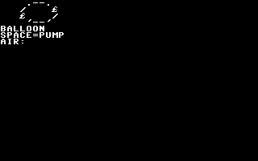

## BASKETBL

A BUILDS SHOT POWER; SPACE RELEASES THE FREE THROW.

Stored payload: **152 bytes**.

[Assembly source](BASKETBL/main.asm)

## BEAM

A/D ROTATES THE TURRET. SPACE FIRES THE BEAM.

Stored payload: **175 bytes**.

[Assembly source](BEAM/main.asm)

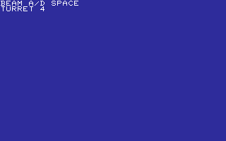

## BLACKJCK

DRAW OR STAND AGAINST A RANDOM DEALER TOTAL.

Stored payload: **248 bytes**.

[Assembly source](BLACKJCK/main.asm)

## BOUNCE

A/D SHIFTS THE BALL; SPACE LANDS ON THE PLATFORM.

Stored payload: **176 bytes**.

[Assembly source](BOUNCE/main.asm)

## BOWLING

A/D AIM, SPACE ROLLS. ACCOUNT FOR THE RANDOM CURVE.

Stored payload: **217 bytes**.

[Assembly source](BOWLING/main.asm)

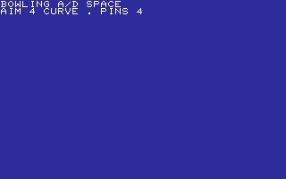

## BOXPUSH

PUSH THE CRATE ONTO THE TARGET WITH A AND D.

Stored payload: **215 bytes**.

[Assembly source](BOXPUSH/main.asm)

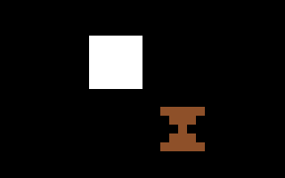

## BRICKS

A/D MOVES THE PADDLE. SPACE SMASHES THE BRICK ROW.

Stored payload: **216 bytes**.

[Assembly source](BRICKS/main.asm)

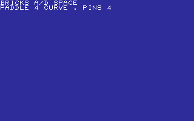

## BUMPCAR

A/D STEERS THE CAR. SPACE RAMS THE OTHER CAR.

Stored payload: **177 bytes**.

[Assembly source](BUMPCAR/main.asm)

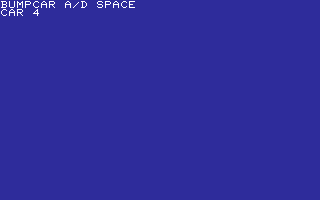

## CATCHER

A/D MOVE BASKET. CATCH STARS. THREE MISSES ENDS GAME.

Stored payload: **241 bytes**.

[Assembly source](CATCHER/main.asm)

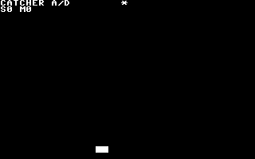

## CAVE

SPACE CLIMBS; RETURN FLIES THROUGH THE CAVE OPENING.

Stored payload: **174 bytes**.

[Assembly source](CAVE/main.asm)

## CHICKEN

TWO-PLAYER CHICKEN. WAIT FOR GO; A OR L SWERVES.

Stored payload: **191 bytes**.

[Assembly source](CHICKEN/main.asm)

## CHOMP

TWO-PLAYER CHOMP. PICK 2-5; SQUARE 1 IS POISON.

Stored payload: **154 bytes**.

[Assembly source](CHOMP/main.asm)

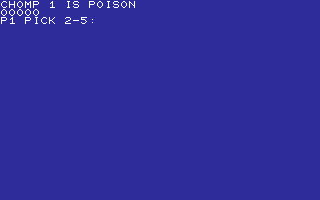

## COPTER

SPACE CLIMBS; RETURN FLIES THROUGH THE CAVE OPENING.

Stored payload: **172 bytes**.

[Assembly source](COPTER/main.asm)

## COWBULL

GUESS FOUR 0-7 DIGITS. B=PLACE C=DIGIT. RETURN=NEW.

Stored payload: **175 bytes**.

[Assembly source](COWBULL/main.asm)

## CRAPS

CRAPS: SPACE ROLLS. MAKE THE POINT BEFORE ROLLING SEVEN.

Stored payload: **230 bytes**.

[Assembly source](CRAPS/main.asm)

## DARTS

A/D MOVES THE CROSSHAIR. SPACE THROWS AT THE BULL.

Stored payload: **191 bytes**.

[Assembly source](DARTS/main.asm)

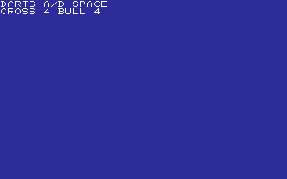

## DEFUSE

CUT WIRES 1-3. THREE SAFE CUTS DEFUSE THE BOMB.

Stored payload: **155 bytes**.

[Assembly source](DEFUSE/main.asm)

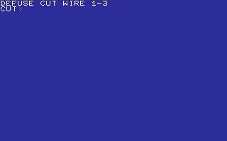

## DICE

SPACE ROLLS TWO DICE WITH A QUICK TUMBLE.

Stored payload: **120 bytes**.

[Assembly source](DICE/main.asm)

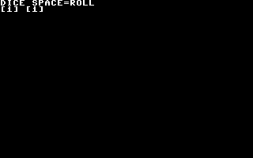

## DOCKING

A/D ADJUST VELOCITY; SPACE DOCKS AT THE TARGET.

Stored payload: **167 bytes**.

[Assembly source](DOCKING/main.asm)

## DODGE

A/D DODGE FALLING BLOCKS. SURVIVE FOR SCORE.

Stored payload: **208 bytes**.

[Assembly source](DODGE/main.asm)

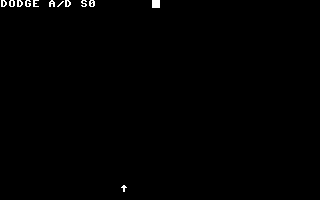

## DROP4

TWO-PLAYER DROP4. PICK A COLUMN; COMPLETE A FOUR-HIGH STACK.

Stored payload: **137 bytes**.

[Assembly source](DROP4/main.asm)

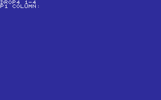

## DUEL

TWO-PLAYER DUEL. WAIT FOR DRAW; A OR L FIRES.

Stored payload: **213 bytes**.

[Assembly source](DUEL/main.asm)

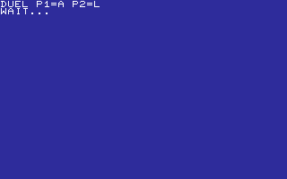

## ECHOSEQ

WATCH THE GROWING A-D SIGNAL SEQUENCE, THEN REPEAT IT.

Stored payload: **171 bytes**.

[Assembly source](ECHOSEQ/main.asm)

## ELEVATOR

A/D ADJUST VELOCITY; SPACE DOCKS AT THE TARGET.

Stored payload: **175 bytes**.

[Assembly source](ELEVATOR/main.asm)

## ESCAPE

A/D MOVES THE RUNNER. SPACE ESCAPES THE ROBOT LANE.

Stored payload: **183 bytes**.

[Assembly source](ESCAPE/main.asm)

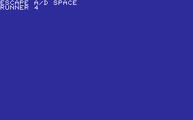

## FALLDOWN

LINE UP WITH EACH RISING FLOOR GAP. A/D MOVE; SPACE FALLS.

Stored payload: **198 bytes**.

[Assembly source](FALLDOWN/main.asm)

## FIREMAN

A/D MOVES THE NET. SPACE CATCHES THE RANDOM JUMPER.

Stored payload: **192 bytes**.

[Assembly source](FIREMAN/main.asm)

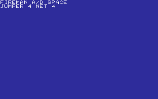

## FISHING

SPACE CASTS. STRIKE ONLY AFTER BITE! APPEARS.

Stored payload: **213 bytes**.

[Assembly source](FISHING/main.asm)

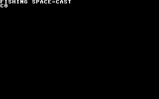

## FIVEDICE

ROLL FIVE DICE THREE TIMES. SIXES BUILD YOUR SCORE.

Stored payload: **196 bytes**.

[Assembly source](FIVEDICE/main.asm)

## FLIPPER

HIT A OR D FOR THE FLIPPER UNDER THE FALLING BALL.

Stored payload: **181 bytes**.

[Assembly source](FLIPPER/main.asm)

## FLOOD

TINY FLOOD-FILL: RECOLOR THE TOP-LEFT REGION B, THEN C.

Stored payload: **201 bytes**.

[Assembly source](FLOOD/main.asm)

## FLUTTER

SPACE FLAPS; RETURN FLIES THROUGH THE CAVE OPENING.

Stored payload: **170 bytes**.

[Assembly source](FLUTTER/main.asm)

## FOXGEESE

TWO-PLAYER FOX AND GOOSE CHASE ON A SEVEN-SPACE BOARD.

Stored payload: **246 bytes**.

[Assembly source](FOXGEESE/main.asm)

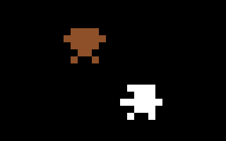

## GOLF

A BUILDS PUTT POWER; SPACE SHOOTS FOR THE RANDOM HOLE.

Stored payload: **154 bytes**.

[Assembly source](GOLF/main.asm)

## GUESSNUM

GUESS 00-99. COMPUTER SAYS HIGH, LOW, OR WIN.

Stored payload: **194 bytes**.

[Assembly source](GUESSNUM/main.asm)

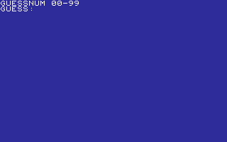

## HANGMAN

GUESS A SIX-LETTER WORD.         SIX MISSES AND YOU LOSE.

Stored payload: **253 bytes**.

[Assembly source](HANGMAN/main.asm)

## HILO

HILO CARD GAME. H=HIGH, L=LOW. GUESS THE NEXT RANK.

Stored payload: **217 bytes**.

[Assembly source](HILO/main.asm)

## HORSES

HORSE RACE. PICK 1-5; FIRST HORSE TO THE FINISH WINS.

Stored payload: **256 bytes**.

[Assembly source](HORSES/main.asm)

## HOTPOT

PASS THE KEYBOARD. A HIDDEN RANDOM FUSE GOES BOOM.

Stored payload: **162 bytes**.

[Assembly source](HOTPOT/main.asm)

## HUNT

HUNT THE TREASURE 1-8. WARM/COLD HINTS GUIDE YOU.

Stored payload: **157 bytes**.

[Assembly source](HUNT/main.asm)

## HURDLES

A BUILDS SPEED; SPACE JUMPS THE RANDOM HURDLE.

Stored payload: **156 bytes**.

[Assembly source](HURDLES/main.asm)

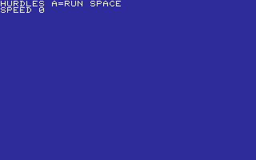

## ICEPATH

SLIDE TO THE WALLS WITH A/D/W/S, THEN REACH THE EXIT.

Stored payload: **187 bytes**.

[Assembly source](ICEPATH/main.asm)

## INVADE

A/D MOVES THE CANNON; SPACE ZAPS THE INVADER.

Stored payload: **177 bytes**.

[Assembly source](INVADE/main.asm)

## JUGGLE

SPACE JUGGLES. RANDOM DROPS REDUCE YOUR THREE BALLS.

Stored payload: **134 bytes**.

[Assembly source](JUGGLE/main.asm)

## JUMPER

CHARGE A JUMP WITH A, THEN SPACE OVER EACH WALL.

Stored payload: **185 bytes**.

[Assembly source](JUMPER/main.asm)

## KNIGHTS

MAKE KNIGHT MOVES WITH A/D/J/L TO REACH C3 R4.

Stored payload: **215 bytes**.

[Assembly source](KNIGHTS/main.asm)

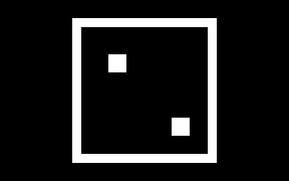

## LANDER

FIRE A TO THRUST. KEEP DESCENT SPEED BELOW THREE.

Stored payload: **178 bytes**.

[Assembly source](LANDER/main.asm)

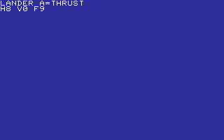

## LAVA

MOVE A/D BEFORE THE CURRENT TILE BURNS. KEEP RUNNING.

Stored payload: **179 bytes**.

[Assembly source](LAVA/main.asm)

## LOCKPICK

A/D TURNS THE DIAL. FIND THE CLICK, THEN SPACE TO OPEN.

Stored payload: **203 bytes**.

[Assembly source](LOCKPICK/main.asm)

## LOTTO

PICK SIX 1-9 DIGITS, THEN MATCH THE RANDOM LOTTO DRAW.

Stored payload: **177 bytes**.

[Assembly source](LOTTO/main.asm)

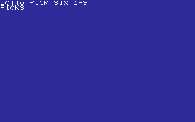

## MANCALA

TWO PLAYERS TAKE 1-3 STONES. TAKE THE LAST TO WIN.

Stored payload: **166 bytes**.

[Assembly source](MANCALA/main.asm)

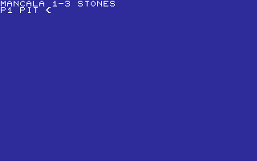

## MATCH

PICK TWO CARDS 1-4. CARDS 1/3 AND 2/4 ARE PAIRS.

Stored payload: **180 bytes**.

[Assembly source](MATCH/main.asm)

## MAZE3D

CHOOSE THE OPEN CORRIDOR WITH A OR D THROUGH FIVE TURNS.

Stored payload: **193 bytes**.

[Assembly source](MAZE3D/main.asm)

## MAZEDARK

FOLLOW THE GLOWING LEFT OR RIGHT PASSAGE THROUGH THE DARK.

Stored payload: **185 bytes**.

[Assembly source](MAZEDARK/main.asm)

## MAZERUN

FOLLOW OPEN CORRIDORS. ESCAPE IN FIVE TURNS WITHIN SEVEN MOVES.

Stored payload: **194 bytes**.

[Assembly source](MAZERUN/main.asm)

## MINES

PICK SAFE TILES 1-8. CLEAR FIVE FIELDS WITHOUT A MINE.

Stored payload: **155 bytes**.

[Assembly source](MINES/main.asm)

## MONTY

PICK 1-3. MONTY OPENS A GOAT. S:SWITCH K:KEEP. STOP:EXIT.

Stored payload: **256 bytes**.

[Assembly source](MONTY/main.asm)

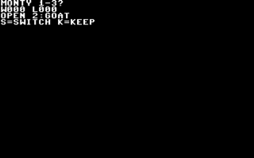

## NIM

TWO PLAYERS TAKE 1-3 COUNTERS. TAKE THE LAST TO WIN.

Stored payload: **157 bytes**.

[Assembly source](NIM/main.asm)

## NUMMEM

MEMORIZE AND REPEAT A THREE-DIGIT SEQUENCE.

Stored payload: **171 bytes**.

[Assembly source](NUMMEM/main.asm)

## NUMRACE

TWO PLAYERS ADD 1 OR 2. HIT TEN EXACTLY TO WIN.

Stored payload: **166 bytes**.

[Assembly source](NUMRACE/main.asm)

## OTHELLO

PLACE BLACK AT 4 TO BRACKET AND FLIP THE WHITE ROW.

Stored payload: **127 bytes**.

[Assembly source](OTHELLO/main.asm)

## PAIRS

PICK TWO OF FOUR CARDS. MATCH THREE PAIRS TO WIN.

Stored payload: **180 bytes**.

[Assembly source](PAIRS/main.asm)

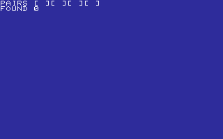

## PEGS

MAKE JUMPS 0, 1, AND 2 TO LEAVE ONE PEG.

Stored payload: **140 bytes**.

[Assembly source](PEGS/main.asm)

## PENALTY

PICK A CORNER BEFORE THE RANDOM KEEPER SAVES IT.

Stored payload: **153 bytes**.

[Assembly source](PENALTY/main.asm)

## PIG

ROLL TOWARD NINE, OR HOLD BEFORE A ONE BUSTS.

Stored payload: **204 bytes**.

[Assembly source](PIG/main.asm)

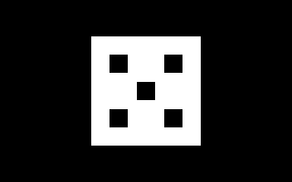

## POKER

SPACE DEALS A TINY FIVE-CARD POKER HAND.

Stored payload: **183 bytes**.

[Assembly source](POKER/main.asm)

## PONG

RETURN THE BALL WITH A ON LEFT OR D ON RIGHT.

Stored payload: **187 bytes**.

[Assembly source](PONG/main.asm)

## REACTION

Wait for GO, then hit a key as quickly as you can.

Stored payload: **135 bytes**.

[Assembly source](REACTION/main.asm)

## ROCKPAPR

ROCK, PAPER, SCISSORS AGAINST A RANDOM COMPUTER PICK.

Stored payload: **234 bytes**.

[Assembly source](ROCKPAPR/main.asm)

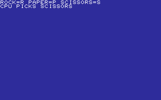

## SLOTS

THREE-REEL SLOTS. MATCH ALL THREE TO WIN.

Stored payload: **205 bytes**.

[Assembly source](SLOTS/main.asm)

## TICTACTO

TWO PLAYERS. KEYS 1-9 PLACE X/O. MAKE A LINE OF THREE.

Stored payload: **253 bytes**.

[Assembly source](TICTACTO/main.asm)

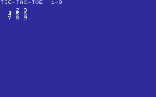

## TUGOWAR

TWO-PLAYER TUG OF WAR. Q PULLS LEFT, P PULLS RIGHT.

Stored payload: **163 bytes**.

[Assembly source](TUGOWAR/main.asm)

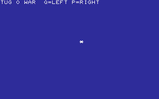

## WHACK

HIT THE DISPLAYED NUMBER KEY FIVE TIMES.

Stored payload: **166 bytes**.

[Assembly source](WHACK/main.asm)

---
**76 programs · 14,123 bytes total · 5333 bytes to spare in this category**

Want to add one? See [Add a program](../../docs/add_program.md)
and the [program interface](../../docs/program-api.md).

Regenerate this page with `python scripts/programs_md.py`.