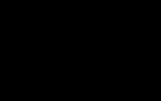
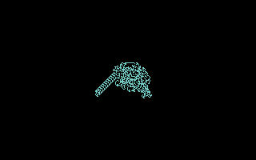
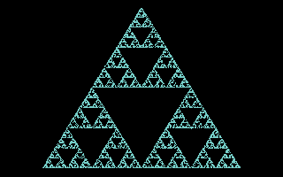
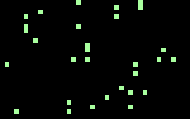
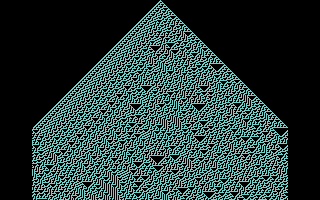

# LAB

EXPERIMENTS AND PROOF OF CONCEPTS.

[All categories](../readme.md) · [Sector 256](../../README.md)

| Icon | Program | Description |
| --- | --- | --- |
|  | [ALIASING](#aliasing) | SHOW TWO SAMPLED POSITIONS OF FAST MOTION. |
|  | [ANT](#ant) | LANGTON'S ANT ON 256X200 HIRES. SPACE:RESET. STOP:RETURN. |
|  | [BEATS](#beats) | HEAR BEATS FROM TWO SLIGHTLY DETUNED SID VOICES. |
|  | [CHAOS](#chaos) | CHAOS GAME BUILDS A FRACTAL. SPACE:RESET. RUN/STOP:RETURN. |
|  | [LIFE](#life) | CONWAY LIFE. SPACE:RANDOMIZE. RUN/STOP:RETURN. |
|  | [RULE30](#rule30) | RULE 30 FROM ONE CELL. SPACE:RESET. RUN/STOP:RETURN. |
|  | [SANDPILE](#sandpile) | SANDPILE FRACTAL. SPACE:RESET WITH NEW COLORS. RUN/STOP:RETURN. |

---

## ALIASING

SHOW TWO SAMPLED POSITIONS OF FAST MOTION.

Stored payload: **112 bytes**.

[Assembly source](ALIASING/main.asm)

## ANT

LANGTON'S ANT ON 256X200 HIRES. SPACE:RESET. STOP:RETURN.

Stored payload: **223 bytes**.

[Assembly source](ANT/main.asm)

## BEATS

HEAR BEATS FROM TWO SLIGHTLY DETUNED SID VOICES.

Stored payload: **114 bytes**.

[Assembly source](BEATS/main.asm)

## CHAOS

CHAOS GAME BUILDS A FRACTAL. SPACE:RESET. RUN/STOP:RETURN.

Stored payload: **187 bytes**.

[Assembly source](CHAOS/main.asm)

## LIFE

CONWAY LIFE. SPACE:RANDOMIZE. RUN/STOP:RETURN.

Stored payload: **243 bytes**.

[Assembly source](LIFE/main.asm)

## RULE30

RULE 30 FROM ONE CELL. SPACE:RESET. RUN/STOP:RETURN.

Stored payload: **220 bytes**.

[Assembly source](RULE30/main.asm)

## SANDPILE

SANDPILE FRACTAL. SPACE:RESET WITH NEW COLORS. RUN/STOP:RETURN.

Stored payload: **244 bytes**.

[Assembly source](SANDPILE/main.asm)

---
**7 programs · 1,343 bytes total · 449 bytes to spare in this category**

Want to add one? See [Add a program](../../docs/add_program.md)
and the [program interface](../../docs/program-api.md).

Regenerate this page with `python scripts/programs_md.py`.