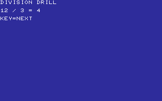
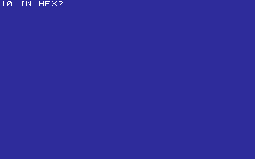
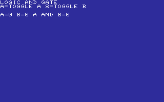
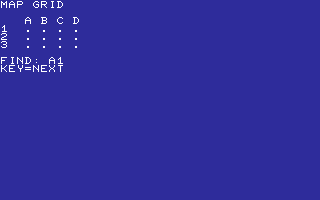
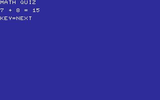
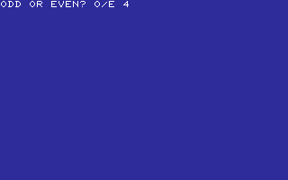

# LESSONS

CORE FACTS, MATH, AND LOGIC PRACTICE.

[All categories](../readme.md) · [Sector 256](../../README.md)

| Icon | Program | Description |
| --- | --- | --- |
|  | [ADDITION](#addition) | SOLVE THREE ONE-DIGIT ADDITION QUESTIONS. |
|  | [BINQUIZ](#binquiz) | CONVERT FOUR SIMPLE BINARY VALUES TO DECIMAL. |
|  | [BITOPS](#bitops) | SOLVE FOUR ONE-BIT AND OR XOR OPERATIONS. |
|  | [CLOCK](#clock) | READ THREE SIMPLE ON-THE-HOUR CLOCK TIMES. |
|  | [COLORS](#colors) | PRACTICE THE C64 COLOR NUMBERS FOR RED, BLUE, AND WHITE. |
|  | [COMPASS](#compass) | NAME THE CARDINAL DIRECTION OF EACH ARROW. |
|  | [COUNTING](#counting) | COUNT THE STARS AND ENTER THE NUMBER. THREE CORRECT WINS. |
|  | [DIVIDE](#divide) | SOLVE THREE SMALL DIVISION QUESTIONS. |
|  | [DIVQUIZ](#divquiz) | Cycles through four compact division facts. |
|  | [ESTIMATE](#estimate) | COUNT A BRIEFLY FLASHED GROUP OF DOTS. |
|  | [FRACTION](#fraction) | IDENTIFY THE TOP NUMBER IN THREE SIMPLE FRACTIONS. |
|  | [GRAPHPT](#graphpt) | READ A MARKED POINT ON A SMALL COORDINATE GRID. |
|  | [GREATER](#greater) | CHOOSE LESS-THAN OR GREATER-THAN FOR EACH PAIR. |
|  | [HEXQUIZ](#hexquiz) | CONVERT FOUR DECIMAL VALUES TO HEX DIGITS. |
|  | [KEYFIND](#keyfind) | FIND AND PRESS EACH HIGHLIGHTED KEY. |
|  | [LOGIC](#logic) | TOGGLE TWO INPUTS AND VIEW THEIR AND-GATE OUTPUT. |
|  | [MAPGRID](#mapgrid) | Cycles through coordinate prompts on a lettered grid. |
|  | [MATHQUIZ](#mathquiz) | Cycles through four compact mixed arithmetic facts. |
|  | [MEASURE](#measure) | ESTIMATE BAR LENGTHS IN CHARACTER CELLS. |
|  | [MULTIPLY](#multiply) | SOLVE THREE SMALL MULTIPLICATION QUESTIONS. |
|  | [NUMLINE](#numline) | READ MARKED VALUES ON SIMPLE NUMBER LINES. |
|  | [ODDEVEN](#oddeven) | MARK RANDOM NUMBERS ODD WITH O OR EVEN WITH E. |
|  | [PRIMEQZ](#primeqz) | DECIDE WHETHER FOUR NUMBERS ARE PRIME WITH Y OR N. |
|  | [QUIZ](#quiz) | ANSWER THREE SHORT ADDITION QUESTIONS. |

---

## ADDITION

SOLVE THREE ONE-DIGIT ADDITION QUESTIONS.

Stored payload: **147 bytes**.

[Assembly source](ADDITION/main.asm)

## BINQUIZ

CONVERT FOUR SIMPLE BINARY VALUES TO DECIMAL.

Stored payload: **174 bytes**.

[Assembly source](BINQUIZ/main.asm)

## BITOPS

SOLVE FOUR ONE-BIT AND OR XOR OPERATIONS.

Stored payload: **181 bytes**.

[Assembly source](BITOPS/main.asm)

## CLOCK

READ THREE SIMPLE ON-THE-HOUR CLOCK TIMES.

Stored payload: **171 bytes**.

[Assembly source](CLOCK/main.asm)

## COLORS

PRACTICE THE C64 COLOR NUMBERS FOR RED, BLUE, AND WHITE.

Stored payload: **176 bytes**.

[Assembly source](COLORS/main.asm)

## COMPASS

NAME THE CARDINAL DIRECTION OF EACH ARROW.

Stored payload: **198 bytes**.

[Assembly source](COMPASS/main.asm)

## COUNTING

COUNT THE STARS AND ENTER THE NUMBER. THREE CORRECT WINS.

Stored payload: **151 bytes**.

[Assembly source](COUNTING/main.asm)

## DIVIDE

SOLVE THREE SMALL DIVISION QUESTIONS.

Stored payload: **145 bytes**.

[Assembly source](DIVIDE/main.asm)

## DIVQUIZ

Cycles through four compact division facts.

Stored payload: **165 bytes**.

[Assembly source](DIVQUIZ/main.asm)

## ESTIMATE

COUNT A BRIEFLY FLASHED GROUP OF DOTS.

Stored payload: **149 bytes**.

[Assembly source](ESTIMATE/main.asm)

## FRACTION

IDENTIFY THE TOP NUMBER IN THREE SIMPLE FRACTIONS.

Stored payload: **163 bytes**.

[Assembly source](FRACTION/main.asm)

## GRAPHPT

READ A MARKED POINT ON A SMALL COORDINATE GRID.

Stored payload: **246 bytes**.

[Assembly source](GRAPHPT/main.asm)

## GREATER

CHOOSE LESS-THAN OR GREATER-THAN FOR EACH PAIR.

Stored payload: **158 bytes**.

[Assembly source](GREATER/main.asm)

## HEXQUIZ

CONVERT FOUR DECIMAL VALUES TO HEX DIGITS.

Stored payload: **179 bytes**.

[Assembly source](HEXQUIZ/main.asm)

## KEYFIND

FIND AND PRESS EACH HIGHLIGHTED KEY.

Stored payload: **167 bytes**.

[Assembly source](KEYFIND/main.asm)

## LOGIC

TOGGLE TWO INPUTS AND VIEW THEIR AND-GATE OUTPUT.

Stored payload: **139 bytes**.

[Assembly source](LOGIC/main.asm)

## MAPGRID

Cycles through coordinate prompts on a lettered grid.

Stored payload: **192 bytes**.

[Assembly source](MAPGRID/main.asm)

## MATHQUIZ

Cycles through four compact mixed arithmetic facts.

Stored payload: **160 bytes**.

[Assembly source](MATHQUIZ/main.asm)

## MEASURE

ESTIMATE BAR LENGTHS IN CHARACTER CELLS.

Stored payload: **196 bytes**.

[Assembly source](MEASURE/main.asm)

## MULTIPLY

SOLVE THREE SMALL MULTIPLICATION QUESTIONS.

Stored payload: **147 bytes**.

[Assembly source](MULTIPLY/main.asm)

## NUMLINE

READ MARKED VALUES ON SIMPLE NUMBER LINES.

Stored payload: **251 bytes**.

[Assembly source](NUMLINE/main.asm)

## ODDEVEN

MARK RANDOM NUMBERS ODD WITH O OR EVEN WITH E.

Stored payload: **156 bytes**.

[Assembly source](ODDEVEN/main.asm)

## PRIMEQZ

DECIDE WHETHER FOUR NUMBERS ARE PRIME WITH Y OR N.

Stored payload: **178 bytes**.

[Assembly source](PRIMEQZ/main.asm)

## QUIZ

ANSWER THREE SHORT ADDITION QUESTIONS.

Stored payload: **147 bytes**.

[Assembly source](QUIZ/main.asm)

---
**24 programs · 4,136 bytes total · 2008 bytes to spare in this category**

Want to add one? See [Add a program](../../docs/add_program.md)
and the [program interface](../../docs/program-api.md).

Regenerate this page with `python scripts/programs_md.py`.