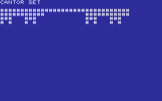
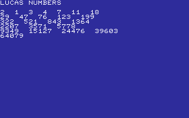
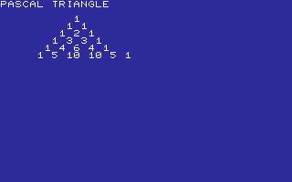
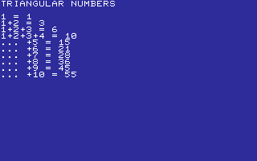

# MATH

NUMBERS, PATTERNS, AND SMALL PROOFS.

[All categories](../readme.md) · [Sector 256](../../README.md)

*  [ARMSTRNG](#armstrng)
*  [BINCOUNT](#bincount)
*  [CANTOR](#cantor)
*  [FIB](#fib)
*  [GCD](#gcd)
*  [GRAYCODE](#graycode)
*  [KAPREKAR](#kaprekar)
*  [LUCAS](#lucas)
*  [MULTAB](#multab)
*  [PASCAL](#pascal)
*  [POWERS2](#powers2)
*  [SQUARES](#squares)
*  [TRIANGNU](#triangnu)

---

## ARMSTRNG

THREE-DIGIT ARMSTRONG NUMBERS AS SUMS OF CUBES.

Stored payload: **137 bytes**.

[Assembly source](ARMSTRNG/main.asm)

## BINCOUNT

AN EIGHT-BIT COUNTER ADVANCED ONE KEY AT A TIME.

Stored payload: **72 bytes**.

[Assembly source](BINCOUNT/main.asm)

## CANTOR

FOUR LEVELS OF THE CANTOR SET IN CHARACTERS.

Stored payload: **170 bytes**.

[Assembly source](CANTOR/main.asm)

## FIB

FIBONACCI NUMBERS THROUGH THE 16-BIT LIMIT.

Stored payload: **164 bytes**.

[Assembly source](FIB/main.asm)

## GCD

EUCLID'S GCD ALGORITHM STEPPED THROUGH AN EXAMPLE.

Stored payload: **110 bytes**.

[Assembly source](GCD/main.asm)

## GRAYCODE

AN EIGHT-BIT GRAY CODE, ONE BIT CHANGE PER STEP.

Stored payload: **70 bytes**.

[Assembly source](GRAYCODE/main.asm)

## KAPREKAR

THE FOUR-DIGIT KAPREKAR ROUTINE TO 6174.

Stored payload: **136 bytes**.

[Assembly source](KAPREKAR/main.asm)

## LUCAS

LUCAS NUMBERS THROUGH THE 16-BIT LIMIT.

Stored payload: **157 bytes**.

[Assembly source](LUCAS/main.asm)

## MULTAB

A COMPACT ONE-THROUGH-FIVE MULTIPLICATION TABLE.

Stored payload: **155 bytes**.

[Assembly source](MULTAB/main.asm)

## PASCAL

THE FIRST SIX ROWS OF PASCAL'S TRIANGLE.

Stored payload: **136 bytes**.

[Assembly source](PASCAL/main.asm)

## POWERS2

POWERS OF TWO THROUGH THE 16-BIT LIMIT.

Stored payload: **224 bytes**.

[Assembly source](POWERS2/main.asm)

## SQUARES

ODD-NUMBER SUMS THAT BUILD PERFECT SQUARES.

Stored payload: **161 bytes**.

[Assembly source](SQUARES/main.asm)

## TRIANGNU

THE FIRST TEN TRIANGULAR NUMBERS AS RUNNING SUMS.

Stored payload: **160 bytes**.

[Assembly source](TRIANGNU/main.asm)

---
**13 programs · 1,852 bytes total · 1476 bytes to spare in this category**

Want to add one? See [Add a program](../../docs/add_program.md)
and the [program interface](../../docs/program-api.md).

Regenerate this page with `python scripts/programs_md.py`.