# NUMBERS

NUMBER THEORY, SEQUENCES, AND CONSTANTS.

[All categories](../readme.md) · [Sector 256](../../README.md)

| Icon | Program | Description |
| --- | --- | --- |
|  | [ARMSTRNG](#armstrng) | THREE-DIGIT ARMSTRONG NUMBERS AS SUMS OF CUBES. |
|  | [BASECONV](#baseconv) | SHOW SMALL VALUES IN BINARY, DECIMAL, AND HEX. |
|  | [BIGADD](#bigadd) | ADDS TWO FIXED 40-DIGIT DECIMAL NUMBERS. |
|  | [BINCOUNT](#bincount) | AN EIGHT-BIT COUNTER ADVANCED ONE KEY AT A TIME. |
|  | [CATALAN](#catalan) | SHOW EARLY CATALAN NUMBERS AND THEIR USE. |
|  | [COLLATZ](#collatz) | SHOW A COLLATZ SEQUENCE AND ITS TWO RULES. |
|  | [DIGROOT](#digroot) | SHOW A REPEATED-DIGIT-SUM DIGITAL ROOT EXAMPLE. |
|  | [DIVISORS](#divisors) | Cycles through four compact worked divisor lists. |
|  | [EDIGITS](#edigits) | DISPLAY LEADING DECIMAL DIGITS OF E. |
|  | [FACTOR](#factor) | COMPACT 16-BIT PRIME FACTORIZATION DEMONSTRATOR. |
|  | [FACTORL](#factorl) | DISPLAY FACTORIAL VALUES THROUGH EIGHT FACTORIAL. |
|  | [FIB](#fib) | FIBONACCI NUMBERS THROUGH THE 16-BIT LIMIT. |
|  | [GCD](#gcd) | EUCLID'S GCD ALGORITHM STEPPED THROUGH AN EXAMPLE. |
|  | [GOLDEN](#golden) | DISPLAY THE GOLDEN RATIO AND ITS RECIPROCAL RULE. |
|  | [GRAYCODE](#graycode) | AN EIGHT-BIT GRAY CODE, ONE BIT CHANGE PER STEP. |
|  | [HAPPY](#happy) | INTRODUCE HAPPY NUMBERS AND THEIR FIRST VALUES. |
|  | [KAPREKAR](#kaprekar) | THE FOUR-DIGIT KAPREKAR ROUTINE TO 6174. |
|  | [LUCAS](#lucas) | LUCAS NUMBERS THROUGH THE 16-BIT LIMIT. |
|  | [PALINDRM](#palindrm) | SHOW A REVERSE-AND-ADD PALINDROME EXAMPLE. |
|  | [PERFECT](#perfect) | SHOW EARLY PERFECT NUMBERS AS DIVISOR SUMS. |
|  | [PI](#pi) | DISPLAY LEADING DECIMAL DIGITS OF PI. |
|  | [POWERS2](#powers2) | POWERS OF TWO THROUGH THE 16-BIT LIMIT. |
|  | [PRIMES](#primes) | A COMPACT LIST OF PRIME NUMBERS THROUGH 97. |
|  | [PRIMSPIR](#primspir) | SHOWS PRIME MARKS IN A COMPACT ULAM SPIRAL. |

---

## ARMSTRNG

THREE-DIGIT ARMSTRONG NUMBERS AS SUMS OF CUBES.

Stored payload: **137 bytes**.

[Assembly source](ARMSTRNG/main.asm)

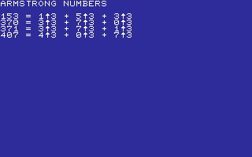

## BASECONV

SHOW SMALL VALUES IN BINARY, DECIMAL, AND HEX.

Stored payload: **119 bytes**.

[Assembly source](BASECONV/main.asm)

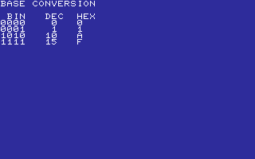

## BIGADD

ADDS TWO FIXED 40-DIGIT DECIMAL NUMBERS.

Stored payload: **240 bytes**.

[Assembly source](BIGADD/main.asm)

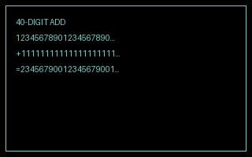

## BINCOUNT

AN EIGHT-BIT COUNTER ADVANCED ONE KEY AT A TIME.

Stored payload: **72 bytes**.

[Assembly source](BINCOUNT/main.asm)

## CATALAN

SHOW EARLY CATALAN NUMBERS AND THEIR USE.

Stored payload: **94 bytes**.

[Assembly source](CATALAN/main.asm)

## COLLATZ

SHOW A COLLATZ SEQUENCE AND ITS TWO RULES.

Stored payload: **89 bytes**.

[Assembly source](COLLATZ/main.asm)

## DIGROOT

SHOW A REPEATED-DIGIT-SUM DIGITAL ROOT EXAMPLE.

Stored payload: **77 bytes**.

[Assembly source](DIGROOT/main.asm)

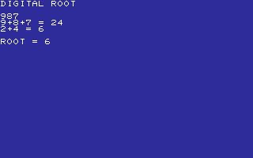

## DIVISORS

Cycles through four compact worked divisor lists.

Stored payload: **189 bytes**.

[Assembly source](DIVISORS/main.asm)

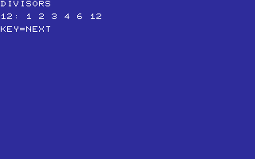

## EDIGITS

DISPLAY LEADING DECIMAL DIGITS OF E.

Stored payload: **84 bytes**.

[Assembly source](EDIGITS/main.asm)

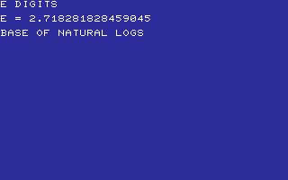

## FACTOR

COMPACT 16-BIT PRIME FACTORIZATION DEMONSTRATOR.

Stored payload: **192 bytes**.

[Assembly source](FACTOR/main.asm)

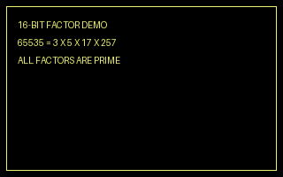

## FACTORL

DISPLAY FACTORIAL VALUES THROUGH EIGHT FACTORIAL.

Stored payload: **101 bytes**.

[Assembly source](FACTORL/main.asm)

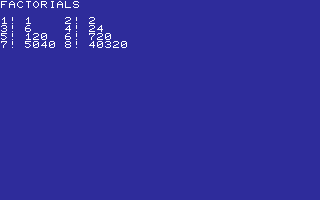

## FIB

FIBONACCI NUMBERS THROUGH THE 16-BIT LIMIT.

Stored payload: **164 bytes**.

[Assembly source](FIB/main.asm)

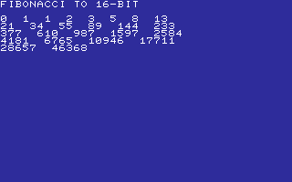

## GCD

EUCLID'S GCD ALGORITHM STEPPED THROUGH AN EXAMPLE.

Stored payload: **110 bytes**.

[Assembly source](GCD/main.asm)

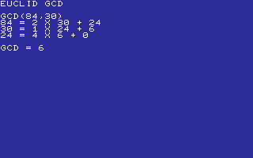

## GOLDEN

DISPLAY THE GOLDEN RATIO AND ITS RECIPROCAL RULE.

Stored payload: **80 bytes**.

[Assembly source](GOLDEN/main.asm)

## GRAYCODE

AN EIGHT-BIT GRAY CODE, ONE BIT CHANGE PER STEP.

Stored payload: **70 bytes**.

[Assembly source](GRAYCODE/main.asm)

## HAPPY

INTRODUCE HAPPY NUMBERS AND THEIR FIRST VALUES.

Stored payload: **103 bytes**.

[Assembly source](HAPPY/main.asm)

## KAPREKAR

THE FOUR-DIGIT KAPREKAR ROUTINE TO 6174.

Stored payload: **136 bytes**.

[Assembly source](KAPREKAR/main.asm)

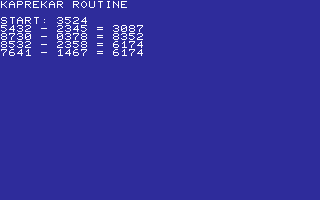

## LUCAS

LUCAS NUMBERS THROUGH THE 16-BIT LIMIT.

Stored payload: **157 bytes**.

[Assembly source](LUCAS/main.asm)

## PALINDRM

SHOW A REVERSE-AND-ADD PALINDROME EXAMPLE.

Stored payload: **81 bytes**.

[Assembly source](PALINDRM/main.asm)

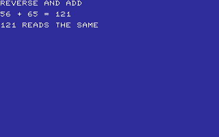

## PERFECT

SHOW EARLY PERFECT NUMBERS AS DIVISOR SUMS.

Stored payload: **104 bytes**.

[Assembly source](PERFECT/main.asm)

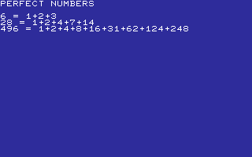

## PI

DISPLAY LEADING DECIMAL DIGITS OF PI.

Stored payload: **76 bytes**.

[Assembly source](PI/main.asm)

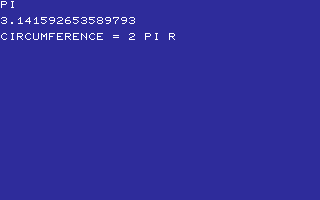

## POWERS2

POWERS OF TWO THROUGH THE 16-BIT LIMIT.

Stored payload: **224 bytes**.

[Assembly source](POWERS2/main.asm)

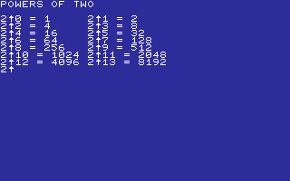

## PRIMES

A COMPACT LIST OF PRIME NUMBERS THROUGH 97.

Stored payload: **115 bytes**.

[Assembly source](PRIMES/main.asm)

## PRIMSPIR

SHOWS PRIME MARKS IN A COMPACT ULAM SPIRAL.

Stored payload: **185 bytes**.

[Assembly source](PRIMSPIR/main.asm)

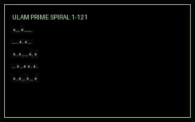

---
**24 programs · 2,999 bytes total · 3145 bytes to spare in this category**

Want to add one? See [Add a program](../../docs/add_program.md)
and the [program interface](../../docs/program-api.md).

Regenerate this page with `python scripts/programs_md.py`.