# PATTERNS

GEOMETRY, PATTERNS, AND MATHEMATICAL FORMS.

[All categories](../readme.md) · [Sector 256](../../README.md)

| Icon | Program | Description |
| --- | --- | --- |
|  | [BINOMIAL](#binomial) | DISPLAY EARLY BINOMIAL COEFFICIENTS. |
|  | [CANTOR](#cantor) | FOUR LEVELS OF THE CANTOR SET IN CHARACTERS. |
|  | [CIRCLE](#circle) | DISPLAY A CHARACTER-MODE CIRCLE WITH AXES. |
|  | [HILBERT](#hilbert) | DISPLAY A SMALL CHARACTER-MODE HILBERT CURVE. |
|  | [KOCH](#koch) | DISPLAY A CHARACTER-MODE KOCH-CURVE MOTIF. |
|  | [LINES](#lines) | DISPLAY A CHARACTER-MODE RADIAL-LINE DIAGRAM. |
| 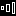 | [LOOKSAY](#looksay) | SHOW EARLY TERMS OF THE LOOK-AND-SAY SEQUENCE. |
|  | [MAGICSQ](#magicsq) | DISPLAY THE CLASSIC 3X3 MAGIC SQUARE. |
|  | [MODCLOCK](#modclock) | ADVANCE A TWELVE-HOUR CLOCK WITH MODULAR ARITHMETIC. |
|  | [MULTAB](#multab) | A COMPACT ONE-THROUGH-FIVE MULTIPLICATION TABLE. |
|  | [PASCAL](#pascal) | THE FIRST SIX ROWS OF PASCAL'S TRIANGLE. |
|  | [PERMUTE](#permute) | LIST ALL 24 PERMUTATIONS OF ABCD. |
|  | [PYTHTRIP](#pythtrip) | SHOW THREE CLASSIC PYTHAGOREAN TRIPLES. |
|  | [ROMAN](#roman) | DISPLAY ROMAN NUMERALS FROM ONE THROUGH TEN. |
|  | [SIERPCAR](#sierpcar) | DISPLAY A CHARACTER-MODE SIERPINSKI CARPET. |
|  | [SINTABLE](#sintable) | DISPLAY COMMON-ANGLE SINE VALUES. |
|  | [SQRT](#sqrt) | DISPLAY SMALL PERFECT SQUARES AND THEIR ROOTS. |
|  | [SQUARES](#squares) | ODD-NUMBER SUMS THAT BUILD PERFECT SQUARES. |
|  | [TOTIENT](#totient) | DISPLAY EULER TOTIENT VALUES THROUGH TEN. |
|  | [TRIANGNU](#triangnu) | THE FIRST TEN TRIANGULAR NUMBERS AS RUNNING SUMS. |

---

## BINOMIAL

DISPLAY EARLY BINOMIAL COEFFICIENTS.

Stored payload: **117 bytes**.

[Assembly source](BINOMIAL/main.asm)

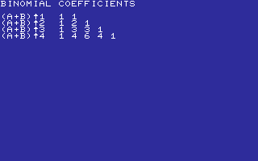

## CANTOR

FOUR LEVELS OF THE CANTOR SET IN CHARACTERS.

Stored payload: **170 bytes**.

[Assembly source](CANTOR/main.asm)

## CIRCLE

DISPLAY A CHARACTER-MODE CIRCLE WITH AXES.

Stored payload: **85 bytes**.

[Assembly source](CIRCLE/main.asm)

## HILBERT

DISPLAY A SMALL CHARACTER-MODE HILBERT CURVE.

Stored payload: **89 bytes**.

[Assembly source](HILBERT/main.asm)

## KOCH

DISPLAY A CHARACTER-MODE KOCH-CURVE MOTIF.

Stored payload: **79 bytes**.

[Assembly source](KOCH/main.asm)

## LINES

DISPLAY A CHARACTER-MODE RADIAL-LINE DIAGRAM.

Stored payload: **106 bytes**.

[Assembly source](LINES/main.asm)

## LOOKSAY

SHOW EARLY TERMS OF THE LOOK-AND-SAY SEQUENCE.

Stored payload: **90 bytes**.

[Assembly source](LOOKSAY/main.asm)

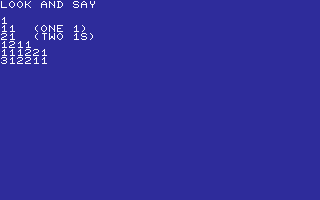

## MAGICSQ

DISPLAY THE CLASSIC 3X3 MAGIC SQUARE.

Stored payload: **88 bytes**.

[Assembly source](MAGICSQ/main.asm)

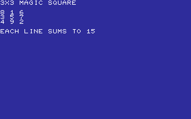

## MODCLOCK

ADVANCE A TWELVE-HOUR CLOCK WITH MODULAR ARITHMETIC.

Stored payload: **132 bytes**.

[Assembly source](MODCLOCK/main.asm)

## MULTAB

A COMPACT ONE-THROUGH-FIVE MULTIPLICATION TABLE.

Stored payload: **155 bytes**.

[Assembly source](MULTAB/main.asm)

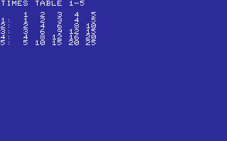

## PASCAL

THE FIRST SIX ROWS OF PASCAL'S TRIANGLE.

Stored payload: **136 bytes**.

[Assembly source](PASCAL/main.asm)

## PERMUTE

LIST ALL 24 PERMUTATIONS OF ABCD.

Stored payload: **169 bytes**.

[Assembly source](PERMUTE/main.asm)

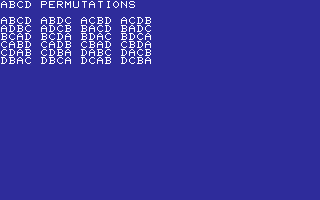

## PYTHTRIP

SHOW THREE CLASSIC PYTHAGOREAN TRIPLES.

Stored payload: **108 bytes**.

[Assembly source](PYTHTRIP/main.asm)

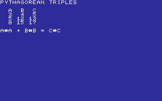

## ROMAN

DISPLAY ROMAN NUMERALS FROM ONE THROUGH TEN.

Stored payload: **107 bytes**.

[Assembly source](ROMAN/main.asm)

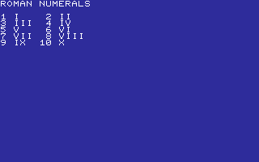

## SIERPCAR

DISPLAY A CHARACTER-MODE SIERPINSKI CARPET.

Stored payload: **128 bytes**.

[Assembly source](SIERPCAR/main.asm)

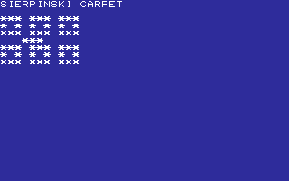

## SINTABLE

DISPLAY COMMON-ANGLE SINE VALUES.

Stored payload: **102 bytes**.

[Assembly source](SINTABLE/main.asm)

## SQRT

DISPLAY SMALL PERFECT SQUARES AND THEIR ROOTS.

Stored payload: **101 bytes**.

[Assembly source](SQRT/main.asm)

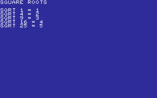

## SQUARES

ODD-NUMBER SUMS THAT BUILD PERFECT SQUARES.

Stored payload: **161 bytes**.

[Assembly source](SQUARES/main.asm)

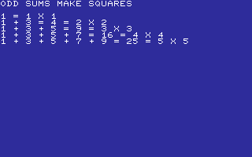

## TOTIENT

DISPLAY EULER TOTIENT VALUES THROUGH TEN.

Stored payload: **96 bytes**.

[Assembly source](TOTIENT/main.asm)

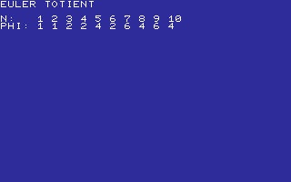

## TRIANGNU

THE FIRST TEN TRIANGULAR NUMBERS AS RUNNING SUMS.

Stored payload: **160 bytes**.

[Assembly source](TRIANGNU/main.asm)

---
**20 programs · 2,379 bytes total · 2741 bytes to spare in this category**

Want to add one? See [Add a program](../../docs/add_program.md)
and the [program interface](../../docs/program-api.md).

Regenerate this page with `python scripts/programs_md.py`.