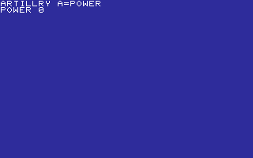
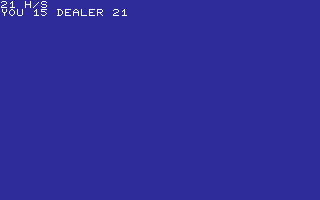
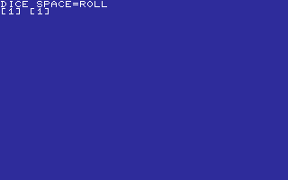
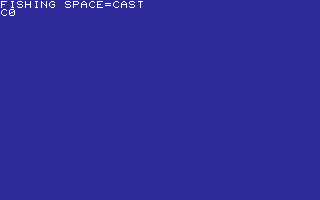
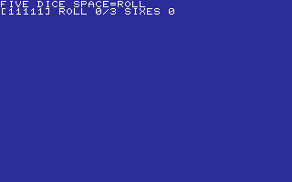
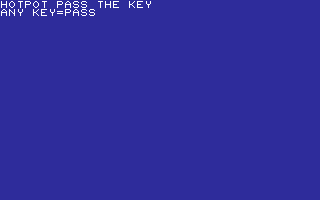
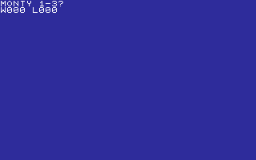
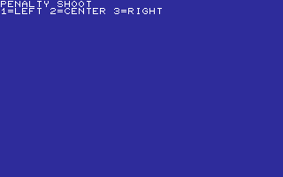

# PLAY

GAMES OF CHANCE, SKILL, AND SPORT.

[All categories](../readme.md) · [Sector 256](../../README.md)

| Icon | Program | Description |
| --- | --- | --- |
|  | [ARCHERY](#archery) | A/D AIM, SPACE FIRES. ACCOUNT FOR THE RANDOM WIND. |
|  | [ARTILLRY](#artillry) | A BUILDS SHELL POWER; SPACE FIRES THE CANNON. |
|  | [BASKETBL](#basketbl) | A BUILDS SHOT POWER; SPACE RELEASES THE FREE THROW. |
|  | [BLACKJCK](#blackjck) | DRAW OR STAND AGAINST A RANDOM DEALER TOTAL. |
|  | [BOWLING](#bowling) | A/D AIM, SPACE ROLLS. ACCOUNT FOR THE RANDOM CURVE. |
|  | [CRAPS](#craps) | CRAPS: SPACE ROLLS. MAKE THE POINT BEFORE ROLLING SEVEN. |
|  | [DARTS](#darts) | A/D MOVES THE CROSSHAIR. SPACE THROWS AT THE BULL. |
|  | [DICE](#dice) | SPACE ROLLS TWO DICE WITH A QUICK TUMBLE. |
|  | [FISHING](#fishing) | SPACE CASTS. STRIKE ONLY AFTER BITE! APPEARS. |
|  | [FIVEDICE](#fivedice) | ROLL FIVE DICE THREE TIMES. SIXES BUILD YOUR SCORE. |
|  | [GOLF](#golf) | A BUILDS PUTT POWER; SPACE SHOOTS FOR THE RANDOM HOLE. |
|  | [HILO](#hilo) | HILO CARD GAME. H=HIGH, L=LOW. GUESS THE NEXT RANK. |
|  | [HORSES](#horses) | HORSE RACE. PICK 1-5; FIRST HORSE TO THE FINISH WINS. |
|  | [HOTPOT](#hotpot) | PASS THE KEYBOARD. A HIDDEN RANDOM FUSE GOES BOOM. |
|  | [HURDLES](#hurdles) | A BUILDS SPEED; SPACE JUMPS THE RANDOM HURDLE. |
|  | [LOTTO](#lotto) | PICK SIX 1-9 DIGITS, THEN MATCH THE RANDOM LOTTO DRAW. |
|  | [MONTY](#monty) | PICK 1-3. MONTY OPENS A GOAT. S:SWITCH K:KEEP. STOP:EXIT. |
|  | [PENALTY](#penalty) | PICK A CORNER BEFORE THE RANDOM KEEPER SAVES IT. |
|  | [PIG](#pig) | ROLL TOWARD NINE, OR HOLD BEFORE A ONE BUSTS. |
|  | [POKER](#poker) | SPACE DEALS A TINY FIVE-CARD POKER HAND. |
|  | [ROULETTE](#roulette) | BET RED OR BLACK AGAINST A COMPACT ROULETTE WHEEL. |
|  | [SLOTS](#slots) | THREE-REEL SLOTS. MATCH ALL THREE TO WIN. |
|  | [SQUASH](#squash) | ONE-PADDLE SQUASH AGAINST THREE WALLS. A/D TO MOVE. |
|  | [TWENTY1](#twenty1) | TAKE 1-3. MAKE THE CPU SAY 21. |

---

## ARCHERY

A/D AIM, SPACE FIRES. ACCOUNT FOR THE RANDOM WIND.

Stored payload: **223 bytes**.

[Assembly source](ARCHERY/main.asm)

## ARTILLRY

A BUILDS SHELL POWER; SPACE FIRES THE CANNON.

Stored payload: **152 bytes**.

[Assembly source](ARTILLRY/main.asm)

## BASKETBL

A BUILDS SHOT POWER; SPACE RELEASES THE FREE THROW.

Stored payload: **152 bytes**.

[Assembly source](BASKETBL/main.asm)

## BLACKJCK

DRAW OR STAND AGAINST A RANDOM DEALER TOTAL.

Stored payload: **248 bytes**.

[Assembly source](BLACKJCK/main.asm)

## BOWLING

A/D AIM, SPACE ROLLS. ACCOUNT FOR THE RANDOM CURVE.

Stored payload: **217 bytes**.

[Assembly source](BOWLING/main.asm)

## CRAPS

CRAPS: SPACE ROLLS. MAKE THE POINT BEFORE ROLLING SEVEN.

Stored payload: **230 bytes**.

[Assembly source](CRAPS/main.asm)

## DARTS

A/D MOVES THE CROSSHAIR. SPACE THROWS AT THE BULL.

Stored payload: **191 bytes**.

[Assembly source](DARTS/main.asm)

## DICE

SPACE ROLLS TWO DICE WITH A QUICK TUMBLE.

Stored payload: **120 bytes**.

[Assembly source](DICE/main.asm)

## FISHING

SPACE CASTS. STRIKE ONLY AFTER BITE! APPEARS.

Stored payload: **213 bytes**.

[Assembly source](FISHING/main.asm)

## FIVEDICE

ROLL FIVE DICE THREE TIMES. SIXES BUILD YOUR SCORE.

Stored payload: **196 bytes**.

[Assembly source](FIVEDICE/main.asm)

## GOLF

A BUILDS PUTT POWER; SPACE SHOOTS FOR THE RANDOM HOLE.

Stored payload: **154 bytes**.

[Assembly source](GOLF/main.asm)

## HILO

HILO CARD GAME. H=HIGH, L=LOW. GUESS THE NEXT RANK.

Stored payload: **217 bytes**.

[Assembly source](HILO/main.asm)

## HORSES

HORSE RACE. PICK 1-5; FIRST HORSE TO THE FINISH WINS.

Stored payload: **256 bytes**.

[Assembly source](HORSES/main.asm)

## HOTPOT

PASS THE KEYBOARD. A HIDDEN RANDOM FUSE GOES BOOM.

Stored payload: **162 bytes**.

[Assembly source](HOTPOT/main.asm)

## HURDLES

A BUILDS SPEED; SPACE JUMPS THE RANDOM HURDLE.

Stored payload: **156 bytes**.

[Assembly source](HURDLES/main.asm)

## LOTTO

PICK SIX 1-9 DIGITS, THEN MATCH THE RANDOM LOTTO DRAW.

Stored payload: **177 bytes**.

[Assembly source](LOTTO/main.asm)

## MONTY

PICK 1-3. MONTY OPENS A GOAT. S:SWITCH K:KEEP. STOP:EXIT.

Stored payload: **256 bytes**.

[Assembly source](MONTY/main.asm)

## PENALTY

PICK A CORNER BEFORE THE RANDOM KEEPER SAVES IT.

Stored payload: **153 bytes**.

[Assembly source](PENALTY/main.asm)

## PIG

ROLL TOWARD NINE, OR HOLD BEFORE A ONE BUSTS.

Stored payload: **204 bytes**.

[Assembly source](PIG/main.asm)

## POKER

SPACE DEALS A TINY FIVE-CARD POKER HAND.

Stored payload: **183 bytes**.

[Assembly source](POKER/main.asm)

## ROULETTE

BET RED OR BLACK AGAINST A COMPACT ROULETTE WHEEL.

Stored payload: **226 bytes**.

[Assembly source](ROULETTE/main.asm)

## SLOTS

THREE-REEL SLOTS. MATCH ALL THREE TO WIN.

Stored payload: **205 bytes**.

[Assembly source](SLOTS/main.asm)

## SQUASH

ONE-PADDLE SQUASH AGAINST THREE WALLS. A/D TO MOVE.

Stored payload: **206 bytes**.

[Assembly source](SQUASH/main.asm)

## TWENTY1

TAKE 1-3. MAKE THE CPU SAY 21.

Stored payload: **208 bytes**.

[Assembly source](TWENTY1/main.asm)

---
**24 programs · 4,705 bytes total · 1439 bytes to spare in this category**

Want to add one? See [Add a program](../../docs/add_program.md)
and the [program interface](../../docs/program-api.md).

Regenerate this page with `python scripts/programs_md.py`.