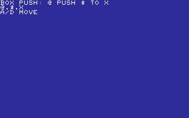
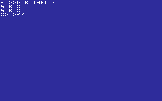
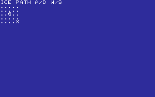
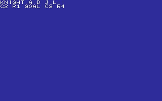
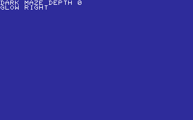
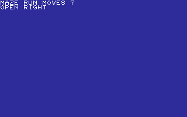
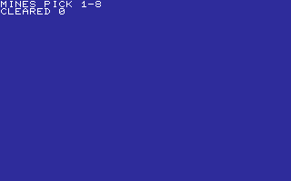
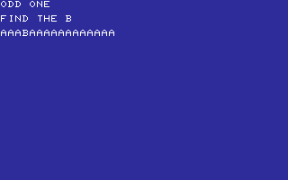

# PUZZLES

THINK IT THROUGH. ONE MOVE AT A TIME.

[All categories](../readme.md) · [Sector 256](../../README.md)

| Icon | Program | Description |
| --- | --- | --- |
|  | [BOXPUSH](#boxpush) | PUSH THE CRATE ONTO THE TARGET WITH A AND D. |
|  | [DEFUSE](#defuse) | CUT WIRES 1-3. THREE SAFE CUTS DEFUSE THE BOMB. |
|  | [ECHOSEQ](#echoseq) | WATCH THE GROWING A-D SIGNAL SEQUENCE, THEN REPEAT IT. |
|  | [FLOOD](#flood) | TINY FLOOD-FILL: RECOLOR THE TOP-LEFT REGION B, THEN C. |
|  | [GUESSNUM](#guessnum) | GUESS 00-99. COMPUTER SAYS HIGH, LOW, OR WIN. |
|  | [HANGMAN](#hangman) | GUESS A SIX-LETTER WORD.         SIX MISSES AND YOU LOSE. |
|  | [HUNT](#hunt) | HUNT THE TREASURE 1-8. WARM/COLD HINTS GUIDE YOU. |
|  | [ICEPATH](#icepath) | SLIDE TO THE WALLS WITH A/D/W/S, THEN REACH THE EXIT. |
|  | [KNIGHTS](#knights) | MAKE KNIGHT MOVES WITH A/D/J/L TO REACH C3 R4. |
|  | [LOCKPICK](#lockpick) | A/D TURNS THE DIAL. FIND THE CLICK, THEN SPACE TO OPEN. |
|  | [MAZE3D](#maze3d) | CHOOSE THE OPEN CORRIDOR WITH A OR D THROUGH FIVE TURNS. |
|  | [MAZEDARK](#mazedark) | FOLLOW THE GLOWING LEFT OR RIGHT PASSAGE THROUGH THE DARK. |
|  | [MAZERUN](#mazerun) | FOLLOW OPEN CORRIDORS. ESCAPE IN FIVE TURNS WITHIN SEVEN MOVES. |
|  | [MINES](#mines) | PICK SAFE TILES 1-8. CLEAR FIVE FIELDS WITHOUT A MINE. |
|  | [NUMMEM](#nummem) | MEMORIZE AND REPEAT A THREE-DIGIT SEQUENCE. |
|  | [ODDONE](#oddone) | Find the single B hidden in a field of A characters. |
|  | [PEGS](#pegs) | MAKE JUMPS 0, 1, AND 2 TO LEAVE ONE PEG. |
|  | [REACTION](#reaction) | Wait for GO, then hit a key as quickly as you can. |
|  | [WHACK](#whack) | HIT THE DISPLAYED NUMBER KEY FIVE TIMES. |

---

## BOXPUSH

PUSH THE CRATE ONTO THE TARGET WITH A AND D.

Stored payload: **215 bytes**.

[Assembly source](BOXPUSH/main.asm)

## DEFUSE

CUT WIRES 1-3. THREE SAFE CUTS DEFUSE THE BOMB.

Stored payload: **155 bytes**.

[Assembly source](DEFUSE/main.asm)

## ECHOSEQ

WATCH THE GROWING A-D SIGNAL SEQUENCE, THEN REPEAT IT.

Stored payload: **171 bytes**.

[Assembly source](ECHOSEQ/main.asm)

## FLOOD

TINY FLOOD-FILL: RECOLOR THE TOP-LEFT REGION B, THEN C.

Stored payload: **201 bytes**.

[Assembly source](FLOOD/main.asm)

## GUESSNUM

GUESS 00-99. COMPUTER SAYS HIGH, LOW, OR WIN.

Stored payload: **194 bytes**.

[Assembly source](GUESSNUM/main.asm)

## HANGMAN

GUESS A SIX-LETTER WORD.         SIX MISSES AND YOU LOSE.

Stored payload: **253 bytes**.

[Assembly source](HANGMAN/main.asm)

## HUNT

HUNT THE TREASURE 1-8. WARM/COLD HINTS GUIDE YOU.

Stored payload: **157 bytes**.

[Assembly source](HUNT/main.asm)

## ICEPATH

SLIDE TO THE WALLS WITH A/D/W/S, THEN REACH THE EXIT.

Stored payload: **187 bytes**.

[Assembly source](ICEPATH/main.asm)

## KNIGHTS

MAKE KNIGHT MOVES WITH A/D/J/L TO REACH C3 R4.

Stored payload: **215 bytes**.

[Assembly source](KNIGHTS/main.asm)

## LOCKPICK

A/D TURNS THE DIAL. FIND THE CLICK, THEN SPACE TO OPEN.

Stored payload: **203 bytes**.

[Assembly source](LOCKPICK/main.asm)

## MAZE3D

CHOOSE THE OPEN CORRIDOR WITH A OR D THROUGH FIVE TURNS.

Stored payload: **193 bytes**.

[Assembly source](MAZE3D/main.asm)

## MAZEDARK

FOLLOW THE GLOWING LEFT OR RIGHT PASSAGE THROUGH THE DARK.

Stored payload: **185 bytes**.

[Assembly source](MAZEDARK/main.asm)

## MAZERUN

FOLLOW OPEN CORRIDORS. ESCAPE IN FIVE TURNS WITHIN SEVEN MOVES.

Stored payload: **194 bytes**.

[Assembly source](MAZERUN/main.asm)

## MINES

PICK SAFE TILES 1-8. CLEAR FIVE FIELDS WITHOUT A MINE.

Stored payload: **155 bytes**.

[Assembly source](MINES/main.asm)

## NUMMEM

MEMORIZE AND REPEAT A THREE-DIGIT SEQUENCE.

Stored payload: **171 bytes**.

[Assembly source](NUMMEM/main.asm)

## ODDONE

Find the single B hidden in a field of A characters.

Stored payload: **80 bytes**.

[Assembly source](ODDONE/main.asm)

## PEGS

MAKE JUMPS 0, 1, AND 2 TO LEAVE ONE PEG.

Stored payload: **140 bytes**.

[Assembly source](PEGS/main.asm)

## REACTION

Wait for GO, then hit a key as quickly as you can.

Stored payload: **135 bytes**.

[Assembly source](REACTION/main.asm)

## WHACK

HIT THE DISPLAYED NUMBER KEY FIVE TIMES.

Stored payload: **166 bytes**.

[Assembly source](WHACK/main.asm)

---
**19 programs · 3,370 bytes total · 1494 bytes to spare in this category**

Want to add one? See [Add a program](../../docs/add_program.md)
and the [program interface](../../docs/program-api.md).

Regenerate this page with `python scripts/programs_md.py`.