# QUESTS

PUZZLES, CHALLENGES, AND TINY ADVENTURES.

[All categories](../readme.md) · [Sector 256](../../README.md)

| Icon | Program | Description |
| --- | --- | --- |
|  | [BINCLOCK](#binclock) | SHOW BINARY DIGITS AS A CLOCK-STYLE DISPLAY. |
|  | [BUBBLES](#bubbles) | Draws a fresh random field of character bubbles. |
|  | [CATEYES](#cateyes) | Steps through four character-art cat-eye directions. |
|  | [CONFETTI](#confetti) | A random PETSCII confetti burst on every key press. |
|  | [DEFUSE](#defuse) | CUT WIRES 1-3. THREE SAFE CUTS DEFUSE THE BOMB. |
|  | [DOODLE](#doodle) | A WASD SKETCHPAD. C CLEARS THE SCREEN. |
|  | [ECHOSEQ](#echoseq) | WATCH THE GROWING A-D SIGNAL SEQUENCE, THEN REPEAT IT. |
|  | [FACES](#faces) | A RANDOM CHARACTER-ART FACE ON EACH KEYPRESS. |
|  | [FLOWERS](#flowers) | Generates a fresh random field of character flowers. |
|  | [FORTUNE](#fortune) | A RANDOM FORTUNE COOKIE MESSAGE ON EACH KEYPRESS. |
|  | [GUESSNUM](#guessnum) | GUESS 00-99. COMPUTER SAYS HIGH, LOW, OR WIN. |
| 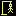 | [HANGMAN](#hangman) | GUESS A SIX-LETTER WORD.         SIX MISSES AND YOU LOSE. |
|  | [HUNT](#hunt) | HUNT THE TREASURE 1-8. WARM/COLD HINTS GUIDE YOU. |
|  | [LOCKPICK](#lockpick) | A/D TURNS THE DIAL. FIND THE CLICK, THEN SPACE TO OPEN. |
|  | [NUMMEM](#nummem) | MEMORIZE AND REPEAT A THREE-DIGIT SEQUENCE. |
|  | [ODDONE](#oddone) | Find the single B hidden in a field of A characters. |
|  | [ORACLE](#oracle) | GET A RANDOM YES-OR-NO STYLE ANSWER. |
|  | [POPCORN](#popcorn) | Generates a fresh random field of popping kernels. |
|  | [REACTION](#reaction) | Wait for GO, then hit a key as quickly as you can. |
|  | [SPARKLER](#sparkler) | Generates a fresh random field of character sparks. |
|  | [SPINNER](#spinner) | SPIN A RANDOM DIRECTION FOR BOARD GAMES. |
|  | [SPINTOP](#spintop) | Steps through four character frames of a spinning top. |
|  | [WHACK](#whack) | HIT THE DISPLAYED NUMBER KEY FIVE TIMES. |
|  | [WINDMILL](#windmill) | SPIN A FOUR-FRAME CHARACTER-ART WINDMILL. |

---

## BINCLOCK

SHOW BINARY DIGITS AS A CLOCK-STYLE DISPLAY.

Stored payload: **88 bytes**.

[Assembly source](BINCLOCK/main.asm)

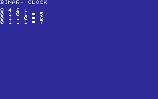

## BUBBLES

Draws a fresh random field of character bubbles.

Stored payload: **81 bytes**.

[Assembly source](BUBBLES/main.asm)

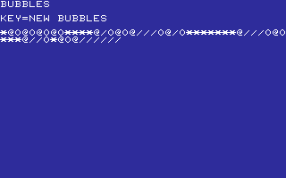

## CATEYES

Steps through four character-art cat-eye directions.

Stored payload: **163 bytes**.

[Assembly source](CATEYES/main.asm)

## CONFETTI

A random PETSCII confetti burst on every key press.

Stored payload: **91 bytes**.

[Assembly source](CONFETTI/main.asm)

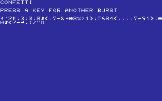

## DEFUSE

CUT WIRES 1-3. THREE SAFE CUTS DEFUSE THE BOMB.

Stored payload: **155 bytes**.

[Assembly source](DEFUSE/main.asm)

## DOODLE

A WASD SKETCHPAD. C CLEARS THE SCREEN.

Stored payload: **144 bytes**.

[Assembly source](DOODLE/main.asm)

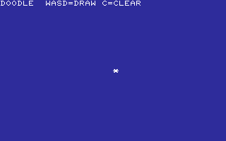

## ECHOSEQ

WATCH THE GROWING A-D SIGNAL SEQUENCE, THEN REPEAT IT.

Stored payload: **171 bytes**.

[Assembly source](ECHOSEQ/main.asm)

## FACES

A RANDOM CHARACTER-ART FACE ON EACH KEYPRESS.

Stored payload: **229 bytes**.

[Assembly source](FACES/main.asm)

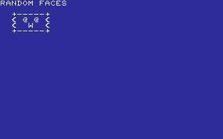

## FLOWERS

Generates a fresh random field of character flowers.

Stored payload: **80 bytes**.

[Assembly source](FLOWERS/main.asm)

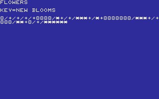

## FORTUNE

A RANDOM FORTUNE COOKIE MESSAGE ON EACH KEYPRESS.

Stored payload: **157 bytes**.

[Assembly source](FORTUNE/main.asm)

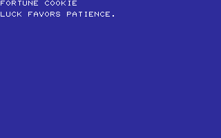

## GUESSNUM

GUESS 00-99. COMPUTER SAYS HIGH, LOW, OR WIN.

Stored payload: **194 bytes**.

[Assembly source](GUESSNUM/main.asm)

## HANGMAN

GUESS A SIX-LETTER WORD.         SIX MISSES AND YOU LOSE.

Stored payload: **253 bytes**.

[Assembly source](HANGMAN/main.asm)

## HUNT

HUNT THE TREASURE 1-8. WARM/COLD HINTS GUIDE YOU.

Stored payload: **157 bytes**.

[Assembly source](HUNT/main.asm)

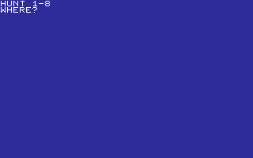

## LOCKPICK

A/D TURNS THE DIAL. FIND THE CLICK, THEN SPACE TO OPEN.

Stored payload: **203 bytes**.

[Assembly source](LOCKPICK/main.asm)

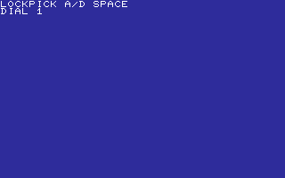

## NUMMEM

MEMORIZE AND REPEAT A THREE-DIGIT SEQUENCE.

Stored payload: **171 bytes**.

[Assembly source](NUMMEM/main.asm)

## ODDONE

Find the single B hidden in a field of A characters.

Stored payload: **80 bytes**.

[Assembly source](ODDONE/main.asm)

## ORACLE

GET A RANDOM YES-OR-NO STYLE ANSWER.

Stored payload: **125 bytes**.

[Assembly source](ORACLE/main.asm)

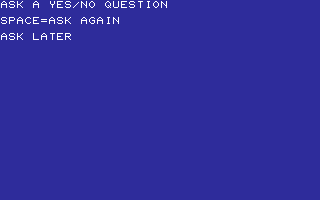

## POPCORN

Generates a fresh random field of popping kernels.

Stored payload: **79 bytes**.

[Assembly source](POPCORN/main.asm)

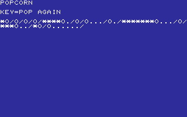

## REACTION

Wait for GO, then hit a key as quickly as you can.

Stored payload: **135 bytes**.

[Assembly source](REACTION/main.asm)

## SPARKLER

Generates a fresh random field of character sparks.

Stored payload: **81 bytes**.

[Assembly source](SPARKLER/main.asm)

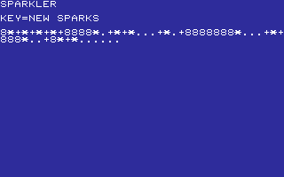

## SPINNER

SPIN A RANDOM DIRECTION FOR BOARD GAMES.

Stored payload: **136 bytes**.

[Assembly source](SPINNER/main.asm)

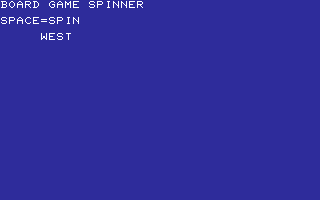

## SPINTOP

Steps through four character frames of a spinning top.

Stored payload: **173 bytes**.

[Assembly source](SPINTOP/main.asm)

## WHACK

HIT THE DISPLAYED NUMBER KEY FIVE TIMES.

Stored payload: **166 bytes**.

[Assembly source](WHACK/main.asm)

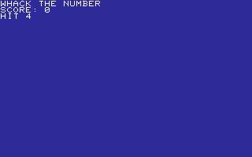

## WINDMILL

SPIN A FOUR-FRAME CHARACTER-ART WINDMILL.

Stored payload: **191 bytes**.

[Assembly source](WINDMILL/main.asm)

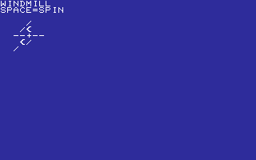

---
**24 programs · 3,503 bytes total in this category**

Want to add one? See [Add a program](../../docs/add_program.md)
and the [program interface](../../docs/program-api.md).

Regenerate this page with `python scripts/programs_md.py`.