# SHOWS

SOUND, LIGHT, AND MINIATURE PERFORMANCES.

[All categories](../readme.md) · [Sector 256](../../README.md)

| Icon | Program | Description |
| --- | --- | --- |
|  | [ARPEGGIO](#arpeggio) | EIGHT FAST C-MAJOR SID ARPEGGIOS. PRESS A KEY TO REPEAT. |
|  | [BEEPER](#beeper) | TYPE KEYS TO ECHO THEM WITH SHORT SID BEEPS. |
|  | [BELLS](#bells) | Alternates two bright SID bell-like pitches. |
|  | [CANDLE](#candle) | SHOW A CHARACTER-ART CANDLE WITH RANDOM FLAME FRAMES. |
|  | [CHORDS](#chords) | C F G PLAY THREE-VOICE SID MAJOR CHORDS. |
|  | [COINSND](#coinsnd) | Alternates two bright SID arcade-coin chimes. |
|  | [CUBE3D](#cube3d) | A ROTATING 3D WIREFRAME CUBE.   RUN/STOP TO RETURN TO LAUNCHER. |
|  | [DANCE](#dance) | DISCO LADY: FOUR VECTOR DANCE POSES. RUN/STOP TO RETURN. |
|  | [DOORBELL](#doorbell) | A TWO-NOTE SID DOORBELL CHIME. PRESS A KEY TO REPEAT. |
|  | [EQUALIZR](#equalizr) | RANDOM CHARACTER-MODE EQUALIZER BARS. |
|  | [HEARTBT](#heartbt) | Alternates character-heart frames with a SID pulse. |
|  | [KLAXON](#klaxon) | Alternates high and low sawtooth SID klaxon tones. |
|  | [METRONOM](#metronom) | PLAY A SHORT SID TICK ON EACH SPACE PRESS. |
|  | [MUSICBOX](#musicbox) | THE OPENING TWINKLE PHRASE ON SID. PRESS A KEY TO REPEAT. |
|  | [NEON](#neon) | Alternates bright and dim character-neon sign frames. |
|  | [PHONERNG](#phonerng) | Alternates two SID tones in a telephone-ring cadence. |
|  | [PIANO](#piano) | A S D F PLAY FOUR SID PIANO NOTES. |
|  | [RASTBARS](#rastbars) | Alternates two compact character raster-bar patterns. |
|  | [SCALE](#scale) | AN ASCENDING C-MAJOR SID SCALE. PRESS A KEY TO REPEAT. |
|  | [SIREN](#siren) | A FOUR-TONE SID SIREN WAIL. PRESS A KEY TO REPEAT. |
|  | [SNOW](#snow) | PIXEL SNOW: BRIGHT FLAKES FALL FAST AND STACK. RUN/STOP:EXIT. |
|  | [SUNSET](#sunset) | Alternates two compact character-art sunset frames. |
|  | [SWEEP](#sweep) | Steps a SID sawtooth tone through rising frequencies. |
|  | [TONEGEN](#tonegen) | Steps a SID voice through four interactive pitch presets. |

---

## ARPEGGIO

EIGHT FAST C-MAJOR SID ARPEGGIOS. PRESS A KEY TO REPEAT.

Stored payload: **120 bytes**.

[Assembly source](ARPEGGIO/main.asm)

## BEEPER

TYPE KEYS TO ECHO THEM WITH SHORT SID BEEPS.

Stored payload: **95 bytes**.

[Assembly source](BEEPER/main.asm)

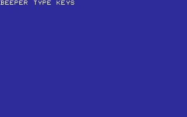

## BELLS

Alternates two bright SID bell-like pitches.

Stored payload: **106 bytes**.

[Assembly source](BELLS/main.asm)

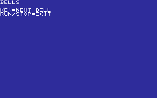

## CANDLE

SHOW A CHARACTER-ART CANDLE WITH RANDOM FLAME FRAMES.

Stored payload: **253 bytes**.

[Assembly source](CANDLE/main.asm)

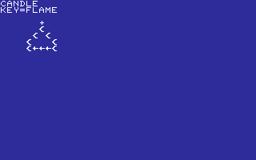

## CHORDS

C F G PLAY THREE-VOICE SID MAJOR CHORDS.

Stored payload: **186 bytes**.

[Assembly source](CHORDS/main.asm)

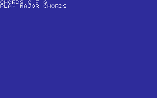

## COINSND

Alternates two bright SID arcade-coin chimes.

Stored payload: **112 bytes**.

[Assembly source](COINSND/main.asm)

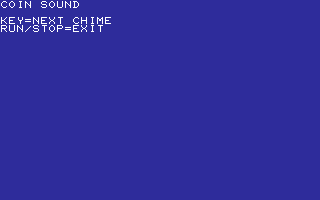

## CUBE3D

A ROTATING 3D WIREFRAME CUBE.   RUN/STOP TO RETURN TO LAUNCHER.

Stored payload: **238 bytes**.

[Assembly source](CUBE3D/main.asm)

## DANCE

DISCO LADY: FOUR VECTOR DANCE POSES. RUN/STOP TO RETURN.

Stored payload: **249 bytes**.

[Assembly source](DANCE/main.asm)

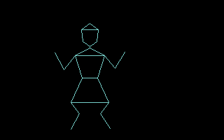

## DOORBELL

A TWO-NOTE SID DOORBELL CHIME. PRESS A KEY TO REPEAT.

Stored payload: **109 bytes**.

[Assembly source](DOORBELL/main.asm)

## EQUALIZR

RANDOM CHARACTER-MODE EQUALIZER BARS.

Stored payload: **97 bytes**.

[Assembly source](EQUALIZR/main.asm)

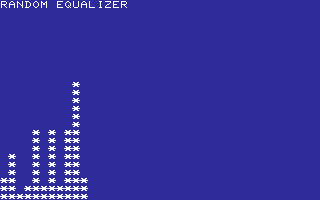

## HEARTBT

Alternates character-heart frames with a SID pulse.

Stored payload: **189 bytes**.

[Assembly source](HEARTBT/main.asm)

## KLAXON

Alternates high and low sawtooth SID klaxon tones.

Stored payload: **119 bytes**.

[Assembly source](KLAXON/main.asm)

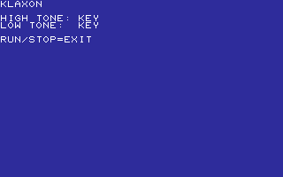

## METRONOM

PLAY A SHORT SID TICK ON EACH SPACE PRESS.

Stored payload: **105 bytes**.

[Assembly source](METRONOM/main.asm)

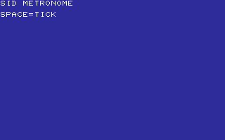

## MUSICBOX

THE OPENING TWINKLE PHRASE ON SID. PRESS A KEY TO REPEAT.

Stored payload: **121 bytes**.

[Assembly source](MUSICBOX/main.asm)

## NEON

Alternates bright and dim character-neon sign frames.

Stored payload: **197 bytes**.

[Assembly source](NEON/main.asm)

## PHONERNG

Alternates two SID tones in a telephone-ring cadence.

Stored payload: **111 bytes**.

[Assembly source](PHONERNG/main.asm)

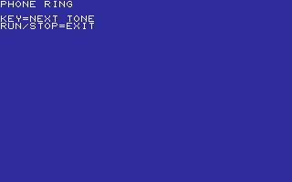

## PIANO

A S D F PLAY FOUR SID PIANO NOTES.

Stored payload: **142 bytes**.

[Assembly source](PIANO/main.asm)

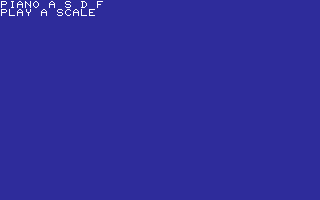

## RASTBARS

Alternates two compact character raster-bar patterns.

Stored payload: **245 bytes**.

[Assembly source](RASTBARS/main.asm)

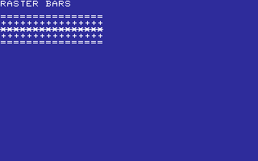

## SCALE

AN ASCENDING C-MAJOR SID SCALE. PRESS A KEY TO REPEAT.

Stored payload: **121 bytes**.

[Assembly source](SCALE/main.asm)

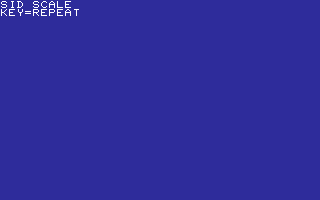

## SIREN

A FOUR-TONE SID SIREN WAIL. PRESS A KEY TO REPEAT.

Stored payload: **113 bytes**.

[Assembly source](SIREN/main.asm)

## SNOW

PIXEL SNOW: BRIGHT FLAKES FALL FAST AND STACK. RUN/STOP:EXIT.

Stored payload: **255 bytes**.

[Assembly source](SNOW/main.asm)

## SUNSET

Alternates two compact character-art sunset frames.

Stored payload: **214 bytes**.

[Assembly source](SUNSET/main.asm)

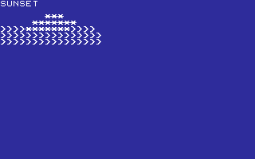

## SWEEP

Steps a SID sawtooth tone through rising frequencies.

Stored payload: **101 bytes**.

[Assembly source](SWEEP/main.asm)

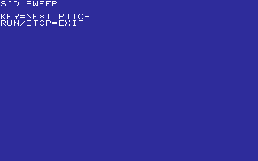

## TONEGEN

Steps a SID voice through four interactive pitch presets.

Stored payload: **118 bytes**.

[Assembly source](TONEGEN/main.asm)

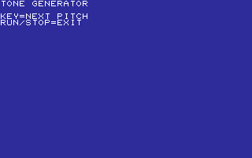

---
**24 programs · 3,716 bytes total · 2428 bytes to spare in this category**

Want to add one? See [Add a program](../../docs/add_program.md)
and the [program interface](../../docs/program-api.md).

Regenerate this page with `python scripts/programs_md.py`.