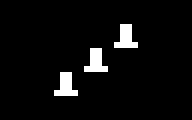

# SOUND

TINY SID SOUNDS AND MUSICAL EXPERIMENTS.

[All categories](../readme.md) · [Sector 256](../../README.md)

*  [ARPEGGIO](#arpeggio)
*  [BEEPER](#beeper)
*  [CHORDS](#chords)
*  [DOORBELL](#doorbell)
*  [PIANO](#piano)
*  [SCALE](#scale)
*  [SIREN](#siren)

---

## ARPEGGIO

EIGHT FAST C-MAJOR SID ARPEGGIOS. PRESS A KEY TO REPEAT.

Stored payload: **120 bytes**.

[Assembly source](ARPEGGIO/main.asm)

## BEEPER

TYPE KEYS TO ECHO THEM WITH SHORT SID BEEPS.

Stored payload: **95 bytes**.

[Assembly source](BEEPER/main.asm)

## CHORDS

C F G PLAY THREE-VOICE SID MAJOR CHORDS.

Stored payload: **186 bytes**.

[Assembly source](CHORDS/main.asm)

## DOORBELL

A TWO-NOTE SID DOORBELL CHIME. PRESS A KEY TO REPEAT.

Stored payload: **109 bytes**.

[Assembly source](DOORBELL/main.asm)

## PIANO

A S D F PLAY FOUR SID PIANO NOTES.

Stored payload: **142 bytes**.

[Assembly source](PIANO/main.asm)

## SCALE

AN ASCENDING C-MAJOR SID SCALE. PRESS A KEY TO REPEAT.

Stored payload: **121 bytes**.

[Assembly source](SCALE/main.asm)

## SIREN

A FOUR-TONE SID SIREN WAIL. PRESS A KEY TO REPEAT.

Stored payload: **113 bytes**.

[Assembly source](SIREN/main.asm)

---
**7 programs · 886 bytes total · 906 bytes to spare in this category**

Want to add one? See [Add a program](../../docs/add_program.md)
and the [program interface](../../docs/program-api.md).

Regenerate this page with `python scripts/programs_md.py`.