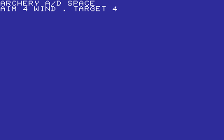
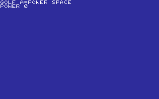

# SPORTS

AIM, THROW, RACE, AND SCORE.

[All categories](../readme.md) · [Sector 256](../../README.md)

| Icon | Program | Description |
| --- | --- | --- |
|  | [ARCHERY](#archery) | A/D AIM, SPACE FIRES. ACCOUNT FOR THE RANDOM WIND. |
|  | [ARTILLRY](#artillry) | A BUILDS SHELL POWER; SPACE FIRES THE CANNON. |
|  | [BASKETBL](#basketbl) | A BUILDS SHOT POWER; SPACE RELEASES THE FREE THROW. |
|  | [BOWLING](#bowling) | A/D AIM, SPACE ROLLS. ACCOUNT FOR THE RANDOM CURVE. |
|  | [DARTS](#darts) | A/D MOVES THE CROSSHAIR. SPACE THROWS AT THE BULL. |
|  | [FISHING](#fishing) | SPACE CASTS. STRIKE ONLY AFTER BITE! APPEARS. |
|  | [GOLF](#golf) | A BUILDS PUTT POWER; SPACE SHOOTS FOR THE RANDOM HOLE. |
|  | [HORSES](#horses) | HORSE RACE. PICK 1-5; FIRST HORSE TO THE FINISH WINS. |
|  | [HURDLES](#hurdles) | A BUILDS SPEED; SPACE JUMPS THE RANDOM HURDLE. |
|  | [PENALTY](#penalty) | PICK A CORNER BEFORE THE RANDOM KEEPER SAVES IT. |

---

## ARCHERY

A/D AIM, SPACE FIRES. ACCOUNT FOR THE RANDOM WIND.

Stored payload: **223 bytes**.

[Assembly source](ARCHERY/main.asm)

## ARTILLRY

A BUILDS SHELL POWER; SPACE FIRES THE CANNON.

Stored payload: **152 bytes**.

[Assembly source](ARTILLRY/main.asm)

## BASKETBL

A BUILDS SHOT POWER; SPACE RELEASES THE FREE THROW.

Stored payload: **152 bytes**.

[Assembly source](BASKETBL/main.asm)

## BOWLING

A/D AIM, SPACE ROLLS. ACCOUNT FOR THE RANDOM CURVE.

Stored payload: **217 bytes**.

[Assembly source](BOWLING/main.asm)

## DARTS

A/D MOVES THE CROSSHAIR. SPACE THROWS AT THE BULL.

Stored payload: **191 bytes**.

[Assembly source](DARTS/main.asm)

## FISHING

SPACE CASTS. STRIKE ONLY AFTER BITE! APPEARS.

Stored payload: **213 bytes**.

[Assembly source](FISHING/main.asm)

## GOLF

A BUILDS PUTT POWER; SPACE SHOOTS FOR THE RANDOM HOLE.

Stored payload: **154 bytes**.

[Assembly source](GOLF/main.asm)

## HORSES

HORSE RACE. PICK 1-5; FIRST HORSE TO THE FINISH WINS.

Stored payload: **256 bytes**.

[Assembly source](HORSES/main.asm)

## HURDLES

A BUILDS SPEED; SPACE JUMPS THE RANDOM HURDLE.

Stored payload: **156 bytes**.

[Assembly source](HURDLES/main.asm)

## PENALTY

PICK A CORNER BEFORE THE RANDOM KEEPER SAVES IT.

Stored payload: **153 bytes**.

[Assembly source](PENALTY/main.asm)

---
**10 programs · 1,867 bytes total · 693 bytes to spare in this category**

Want to add one? See [Add a program](../../docs/add_program.md)
and the [program interface](../../docs/program-api.md).

Regenerate this page with `python scripts/programs_md.py`.