# STUDY

EXTRA PRACTICE, SHAPES, AND TOPIC STUDY.

[All categories](../readme.md) · [Sector 256](../../README.md)

| Icon | Program | Description |
| --- | --- | --- |
|  | [ANGLES](#angles) | ESTIMATE THE ANGLE OF A DRAWN LINE. |
|  | [CALENDAR](#calendar) | MONTH CALENDAR REFERENCE FOR MARCH 2026. |
|  | [CLOCKQZ](#clockqz) | READ THE ANALOG CLOCK AND TYPE THE HOUR. |
|  | [INTERVAL](#interval) | IDENTIFY MUSICAL INTERVALS BY EAR. |
|  | [MEMORY](#memory) | REPEAT THE THREE-NUMBER SEQUENCE FROM MEMORY. |
|  | [MONEY](#money) | COUNT COINS TO MAKE THE TARGET TOTAL. |
|  | [MORSEQZ](#morseqz) | HEAR A MORSE LETTER AND TYPE ITS NAME. |
| 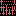 | [NOTEREAD](#noteread) | NAME THE NOTE SHOWN ON A SIMPLE STAFF. |
|  | [OPCODES](#opcodes) | QUIZ ON A COMMON 6502 OPCODE BYTE. |
|  | [PETSCIIQ](#petsciiq) | TYPE THE DECIMAL PETSCII CODES OF DISPLAYED LETTERS. |
|  | [PIANOQZ](#pianoqz) | NAME THE NOTE YOU HEAR FROM THE SID. |
|  | [RHYTHM](#rhythm) | TAP BACK A SHORT THREE-BEAT RHYTHM. |
|  | [ROUNDING](#rounding) | ROUND TWO-DIGIT NUMBERS TO THE NEAREST TEN. |
|  | [SEQUENCE](#sequence) | COMPLETE THREE SIMPLE NUMBER SEQUENCES. |
|  | [SHAPEQZ](#shapeqz) | IDENTIFY SIMPLE SHAPES BY THEIR NUMBER OF SIDES. |
|  | [SHAPES](#shapes) | IDENTIFY CIRCLE, SQUARE, AND TRIANGLE BY NUMBER. |
|  | [SPACE](#space) | PICK THE FIRST LETTER OF THREE SPACE WORDS. |
|  | [SPORTS](#sports) | PICK THE FIRST LETTER OF THREE SPORT WORDS. |
|  | [SQUAREQZ](#squareqz) | RECALL FOUR SMALL SQUARE-NUMBER PRODUCTS. |
|  | [SUBTRACT](#subtract) | SOLVE THREE ONE-DIGIT SUBTRACTION QUESTIONS. |
|  | [TIMESDRL](#timesdrl) | Cycles through four compact multiplication facts. |
|  | [TRANSPRT](#transprt) | PICK THE FIRST LETTER OF THREE TRANSPORT WORDS. |
|  | [TYPETUT](#typetut) | PRACTICE THE HOME-ROW ASDF KEYS. |
|  | [WEATHER](#weather) | PICK THE FIRST LETTER OF THREE WEATHER WORDS. |

---

## ANGLES

ESTIMATE THE ANGLE OF A DRAWN LINE.

Stored payload: **139 bytes**.

[Assembly source](ANGLES/main.asm)

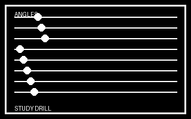

## CALENDAR

MONTH CALENDAR REFERENCE FOR MARCH 2026.

Stored payload: **171 bytes**.

[Assembly source](CALENDAR/main.asm)

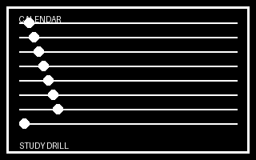

## CLOCKQZ

READ THE ANALOG CLOCK AND TYPE THE HOUR.

Stored payload: **149 bytes**.

[Assembly source](CLOCKQZ/main.asm)

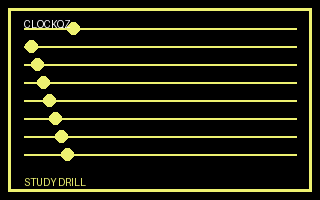

## INTERVAL

IDENTIFY MUSICAL INTERVALS BY EAR.

Stored payload: **190 bytes**.

[Assembly source](INTERVAL/main.asm)

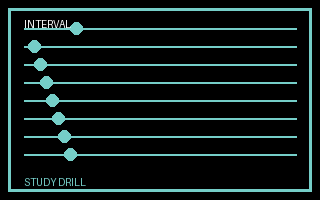

## MEMORY

REPEAT THE THREE-NUMBER SEQUENCE FROM MEMORY.

Stored payload: **140 bytes**.

[Assembly source](MEMORY/main.asm)

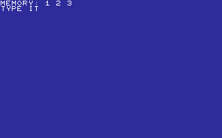

## MONEY

COUNT COINS TO MAKE THE TARGET TOTAL.

Stored payload: **135 bytes**.

[Assembly source](MONEY/main.asm)

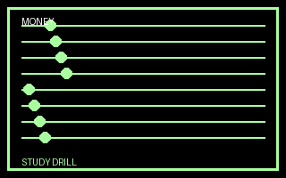

## MORSEQZ

HEAR A MORSE LETTER AND TYPE ITS NAME.

Stored payload: **164 bytes**.

[Assembly source](MORSEQZ/main.asm)

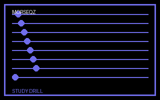

## NOTEREAD

NAME THE NOTE SHOWN ON A SIMPLE STAFF.

Stored payload: **133 bytes**.

[Assembly source](NOTEREAD/main.asm)

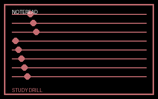

## OPCODES

QUIZ ON A COMMON 6502 OPCODE BYTE.

Stored payload: **110 bytes**.

[Assembly source](OPCODES/main.asm)

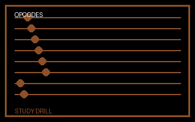

## PETSCIIQ

TYPE THE DECIMAL PETSCII CODES OF DISPLAYED LETTERS.

Stored payload: **195 bytes**.

[Assembly source](PETSCIIQ/main.asm)

## PIANOQZ

NAME THE NOTE YOU HEAR FROM THE SID.

Stored payload: **158 bytes**.

[Assembly source](PIANOQZ/main.asm)

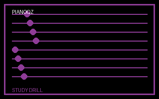

## RHYTHM

TAP BACK A SHORT THREE-BEAT RHYTHM.

Stored payload: **186 bytes**.

[Assembly source](RHYTHM/main.asm)

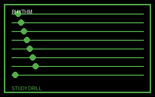

## ROUNDING

ROUND TWO-DIGIT NUMBERS TO THE NEAREST TEN.

Stored payload: **182 bytes**.

[Assembly source](ROUNDING/main.asm)

## SEQUENCE

COMPLETE THREE SIMPLE NUMBER SEQUENCES.

Stored payload: **163 bytes**.

[Assembly source](SEQUENCE/main.asm)

## SHAPEQZ

IDENTIFY SIMPLE SHAPES BY THEIR NUMBER OF SIDES.

Stored payload: **245 bytes**.

[Assembly source](SHAPEQZ/main.asm)

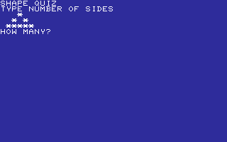

## SHAPES

IDENTIFY CIRCLE, SQUARE, AND TRIANGLE BY NUMBER.

Stored payload: **163 bytes**.

[Assembly source](SHAPES/main.asm)

## SPACE

PICK THE FIRST LETTER OF THREE SPACE WORDS.

Stored payload: **173 bytes**.

[Assembly source](SPACE/main.asm)

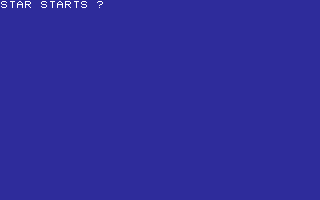

## SPORTS

PICK THE FIRST LETTER OF THREE SPORT WORDS.

Stored payload: **174 bytes**.

[Assembly source](SPORTS/main.asm)

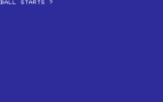

## SQUAREQZ

RECALL FOUR SMALL SQUARE-NUMBER PRODUCTS.

Stored payload: **178 bytes**.

[Assembly source](SQUAREQZ/main.asm)

## SUBTRACT

SOLVE THREE ONE-DIGIT SUBTRACTION QUESTIONS.

Stored payload: **147 bytes**.

[Assembly source](SUBTRACT/main.asm)

## TIMESDRL

Cycles through four compact multiplication facts.

Stored payload: **162 bytes**.

[Assembly source](TIMESDRL/main.asm)

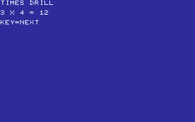

## TRANSPRT

PICK THE FIRST LETTER OF THREE TRANSPORT WORDS.

Stored payload: **174 bytes**.

[Assembly source](TRANSPRT/main.asm)

## TYPETUT

PRACTICE THE HOME-ROW ASDF KEYS.

Stored payload: **135 bytes**.

[Assembly source](TYPETUT/main.asm)

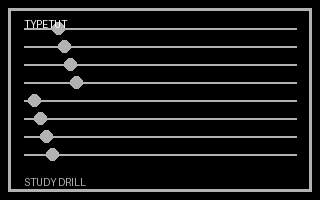

## WEATHER

PICK THE FIRST LETTER OF THREE WEATHER WORDS.

Stored payload: **172 bytes**.

[Assembly source](WEATHER/main.asm)

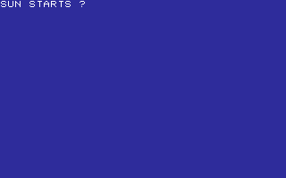

---
**24 programs · 3,938 bytes total in this category**

Want to add one? See [Add a program](../../docs/add_program.md)
and the [program interface](../../docs/program-api.md).

Regenerate this page with `python scripts/programs_md.py`.