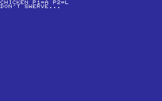
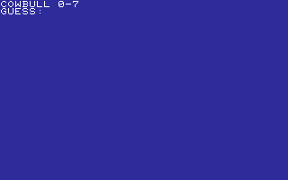
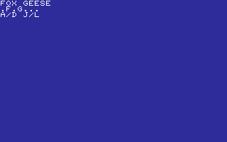
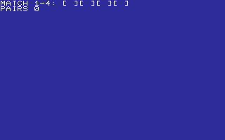
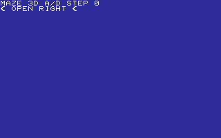
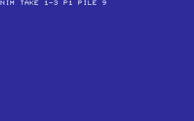
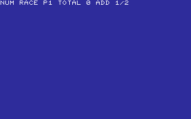
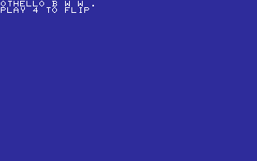

# TABLETOP

BOARD, CARD, AND TACTICAL GAMES.

[All categories](../readme.md) · [Sector 256](../../README.md)

| Icon | Program | Description |
| --- | --- | --- |
|  | [BOXPUSH](#boxpush) | PUSH THE CRATE ONTO THE TARGET WITH A AND D. |
|  | [CHICKEN](#chicken) | TWO-PLAYER CHICKEN. WAIT FOR GO; A OR L SWERVES. |
|  | [CHOMP](#chomp) | TWO-PLAYER CHOMP. PICK 2-5; SQUARE 1 IS POISON. |
|  | [COWBULL](#cowbull) | GUESS FOUR 0-7 DIGITS. B=PLACE C=DIGIT. RETURN=NEW. |
|  | [DROP4](#drop4) | TWO-PLAYER DROP4. PICK A COLUMN; COMPLETE A FOUR-HIGH STACK. |
|  | [DUEL](#duel) | TWO-PLAYER DUEL. WAIT FOR DRAW; A OR L FIRES. |
|  | [FLOOD](#flood) | TINY FLOOD-FILL: RECOLOR THE TOP-LEFT REGION B, THEN C. |
|  | [FOXGEESE](#foxgeese) | TWO-PLAYER FOX AND GOOSE CHASE ON A SEVEN-SPACE BOARD. |
|  | [ICEPATH](#icepath) | SLIDE TO THE WALLS WITH A/D/W/S, THEN REACH THE EXIT. |
|  | [KNIGHTS](#knights) | MAKE KNIGHT MOVES WITH A/D/J/L TO REACH C3 R4. |
|  | [MANCALA](#mancala) | TWO PLAYERS TAKE 1-3 STONES. TAKE THE LAST TO WIN. |
|  | [MATCH](#match) | PICK TWO CARDS 1-4. CARDS 1/3 AND 2/4 ARE PAIRS. |
|  | [MAZE3D](#maze3d) | CHOOSE THE OPEN CORRIDOR WITH A OR D THROUGH FIVE TURNS. |
|  | [MAZEDARK](#mazedark) | FOLLOW THE GLOWING LEFT OR RIGHT PASSAGE THROUGH THE DARK. |
|  | [MAZERUN](#mazerun) | FOLLOW OPEN CORRIDORS. ESCAPE IN FIVE TURNS WITHIN SEVEN MOVES. |
|  | [MINES](#mines) | PICK SAFE TILES 1-8. CLEAR FIVE FIELDS WITHOUT A MINE. |
|  | [NIM](#nim) | TWO PLAYERS TAKE 1-3 COUNTERS. TAKE THE LAST TO WIN. |
|  | [NUMRACE](#numrace) | TWO PLAYERS ADD 1 OR 2. HIT TEN EXACTLY TO WIN. |
|  | [OTHELLO](#othello) | PLACE BLACK AT 4 TO BRACKET AND FLIP THE WHITE ROW. |
|  | [PAIRS](#pairs) | PICK TWO OF FOUR CARDS. MATCH THREE PAIRS TO WIN. |
|  | [PEGS](#pegs) | MAKE JUMPS 0, 1, AND 2 TO LEAVE ONE PEG. |
|  | [ROCKPAPR](#rockpapr) | ROCK, PAPER, SCISSORS AGAINST A RANDOM COMPUTER PICK. |
|  | [TICTACTO](#tictacto) | TWO PLAYERS. KEYS 1-9 PLACE X/O. MAKE A LINE OF THREE. |
|  | [TUGOWAR](#tugowar) | TWO-PLAYER TUG OF WAR. Q PULLS LEFT, P PULLS RIGHT. |

---

## BOXPUSH

PUSH THE CRATE ONTO THE TARGET WITH A AND D.

Stored payload: **215 bytes**.

[Assembly source](BOXPUSH/main.asm)

## CHICKEN

TWO-PLAYER CHICKEN. WAIT FOR GO; A OR L SWERVES.

Stored payload: **191 bytes**.

[Assembly source](CHICKEN/main.asm)

## CHOMP

TWO-PLAYER CHOMP. PICK 2-5; SQUARE 1 IS POISON.

Stored payload: **154 bytes**.

[Assembly source](CHOMP/main.asm)

## COWBULL

GUESS FOUR 0-7 DIGITS. B=PLACE C=DIGIT. RETURN=NEW.

Stored payload: **175 bytes**.

[Assembly source](COWBULL/main.asm)

## DROP4

TWO-PLAYER DROP4. PICK A COLUMN; COMPLETE A FOUR-HIGH STACK.

Stored payload: **137 bytes**.

[Assembly source](DROP4/main.asm)

## DUEL

TWO-PLAYER DUEL. WAIT FOR DRAW; A OR L FIRES.

Stored payload: **213 bytes**.

[Assembly source](DUEL/main.asm)

## FLOOD

TINY FLOOD-FILL: RECOLOR THE TOP-LEFT REGION B, THEN C.

Stored payload: **201 bytes**.

[Assembly source](FLOOD/main.asm)

## FOXGEESE

TWO-PLAYER FOX AND GOOSE CHASE ON A SEVEN-SPACE BOARD.

Stored payload: **246 bytes**.

[Assembly source](FOXGEESE/main.asm)

## ICEPATH

SLIDE TO THE WALLS WITH A/D/W/S, THEN REACH THE EXIT.

Stored payload: **187 bytes**.

[Assembly source](ICEPATH/main.asm)

## KNIGHTS

MAKE KNIGHT MOVES WITH A/D/J/L TO REACH C3 R4.

Stored payload: **215 bytes**.

[Assembly source](KNIGHTS/main.asm)

## MANCALA

TWO PLAYERS TAKE 1-3 STONES. TAKE THE LAST TO WIN.

Stored payload: **166 bytes**.

[Assembly source](MANCALA/main.asm)

## MATCH

PICK TWO CARDS 1-4. CARDS 1/3 AND 2/4 ARE PAIRS.

Stored payload: **180 bytes**.

[Assembly source](MATCH/main.asm)

## MAZE3D

CHOOSE THE OPEN CORRIDOR WITH A OR D THROUGH FIVE TURNS.

Stored payload: **193 bytes**.

[Assembly source](MAZE3D/main.asm)

## MAZEDARK

FOLLOW THE GLOWING LEFT OR RIGHT PASSAGE THROUGH THE DARK.

Stored payload: **185 bytes**.

[Assembly source](MAZEDARK/main.asm)

## MAZERUN

FOLLOW OPEN CORRIDORS. ESCAPE IN FIVE TURNS WITHIN SEVEN MOVES.

Stored payload: **194 bytes**.

[Assembly source](MAZERUN/main.asm)

## MINES

PICK SAFE TILES 1-8. CLEAR FIVE FIELDS WITHOUT A MINE.

Stored payload: **155 bytes**.

[Assembly source](MINES/main.asm)

## NIM

TWO PLAYERS TAKE 1-3 COUNTERS. TAKE THE LAST TO WIN.

Stored payload: **157 bytes**.

[Assembly source](NIM/main.asm)

## NUMRACE

TWO PLAYERS ADD 1 OR 2. HIT TEN EXACTLY TO WIN.

Stored payload: **166 bytes**.

[Assembly source](NUMRACE/main.asm)

## OTHELLO

PLACE BLACK AT 4 TO BRACKET AND FLIP THE WHITE ROW.

Stored payload: **127 bytes**.

[Assembly source](OTHELLO/main.asm)

## PAIRS

PICK TWO OF FOUR CARDS. MATCH THREE PAIRS TO WIN.

Stored payload: **180 bytes**.

[Assembly source](PAIRS/main.asm)

## PEGS

MAKE JUMPS 0, 1, AND 2 TO LEAVE ONE PEG.

Stored payload: **140 bytes**.

[Assembly source](PEGS/main.asm)

## ROCKPAPR

ROCK, PAPER, SCISSORS AGAINST A RANDOM COMPUTER PICK.

Stored payload: **234 bytes**.

[Assembly source](ROCKPAPR/main.asm)

## TICTACTO

TWO PLAYERS. KEYS 1-9 PLACE X/O. MAKE A LINE OF THREE.

Stored payload: **253 bytes**.

[Assembly source](TICTACTO/main.asm)

## TUGOWAR

TWO-PLAYER TUG OF WAR. Q PULLS LEFT, P PULLS RIGHT.

Stored payload: **163 bytes**.

[Assembly source](TUGOWAR/main.asm)

---
**24 programs · 4,427 bytes total in this category**

Want to add one? See [Add a program](../../docs/add_program.md)
and the [program interface](../../docs/program-api.md).

Regenerate this page with `python scripts/programs_md.py`.