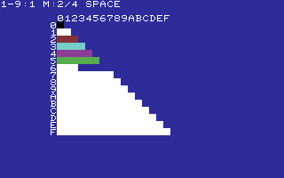

# SWATCH

A **256-byte** temporal color-swatch utility. Open **TOOLS**, select **SWATCH**,
and press RETURN. The lower triangle shows every distinct pair of C64 palette
colors once. Read hexadecimal color A on the left and color B above the grid.
The diagonal contains the 16 original colors, initialized once and never
repainted during animation. Only the 120 mixed cells below it are updated;
the duplicate half of the matrix stays blank.

| Key | Action |
| --- | --- |
| 1–9 | Set video frames per phase; the current value follows `1-9:`. |
| M | Cycle A:B ratios: 2:2, 1:3, 3:1. `M:n/4` gives A's share of four frames. |
| SPACE | Hold or resume the current native-color frame. |
| RUN/STOP | Return to the same launcher page. |

At rate 1, equal mixing alternates A/B every video frame: approximately
20 ms per phase on PAL or 16.7 ms on NTSC. Unequal mixing uses four phases,
with three exposures to one color and one to the other. Rate 9 holds each
phase for nine video frames. Updates begin at raster line 256.

These three duty ratios cover **376 nominal two-color recipes**: 16 unmixed
colors, 120 equal pairs, and 240 unequal pairs. M selects which source dominates
each unequal pair. This is the set of two-color mixtures representable by
four equally timed frames, not an enumeration of mixtures involving three
or four different source colors or arbitrary exposure ratios.

The VIC-II still outputs its original 16 colors. The apparent blends depend
on refresh rate, screen persistence, brightness, color calibration, and
emulator/display behavior. Some recipes can appear alike or visibly flicker;
there is no universal list of distinct extra hardware colors. SPACE holds
one source frame, so it deliberately reveals the original colors.

All triangle coloring, timing, ratio controls, and labels live in the program's
256-byte payload. The launcher supplies standard text clearing/output and
cooperative keyboard/exit services. Four checkerboard icons use only the
exact C64 authoring palette and cycle at the fastest launcher rate.

This version uses text mode and color RAM at `$d800`; it does not switch
VIC-II banks. Text-mode color RAM is shared across banks. The source-color
instruction is selected once per phase, and a one-time initialization changes
the loop to skip the diagonal. Steady drawing takes about 2230 CPU cycles,
down from 6183–6695, before raster waiting and IRQ/display overhead.

VICE measurements on PAL and NTSC confirm one video frame per phase at
rate 1, two at rate 2, and nine at rate 9. A display or emulator that samples
or drops frames can make faster flicker appear slower. Bitmap bank switching
could remove the remaining cell writes, while the full-frame cadence would
still be limited by video refresh.

The static preview uses arithmetic RGB averages of the project's authoring
palette as a visual reference, **not measured colors from a C64 display**.
`preview.gif` contains the actual alternating native-color frames reconstructed
from executed C64 screen/color RAM; GIF playback can change their timing.
