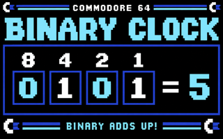
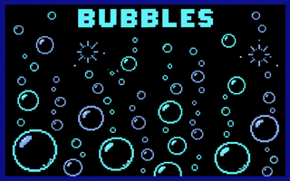
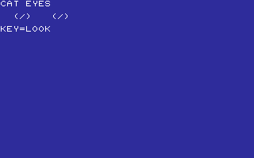
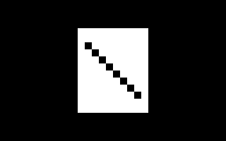
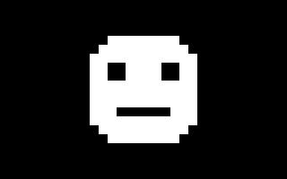
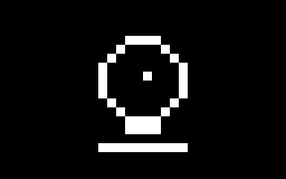
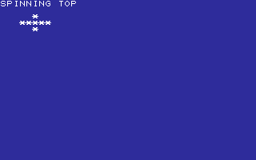

# TOYS

SMALL THINGS TO PLAY WITH.

[All categories](../readme.md) · [Sector 256](../../README.md)

| Icon | Program | Description |
| --- | --- | --- |
|  | [BINCLOCK](#binclock) | SHOW BINARY DIGITS AS A CLOCK-STYLE DISPLAY. |
|  | [BUBBLES](#bubbles) | Draws a fresh random field of character bubbles. |
|  | [CATEYES](#cateyes) | Steps through four character-art cat-eye directions. |
|  | [CONFETTI](#confetti) | A random PETSCII confetti burst on every key press. |
|  | [DOODLE](#doodle) | A WASD SKETCHPAD. C CLEARS THE SCREEN. |
|  | [FACES](#faces) | A RANDOM CHARACTER-ART FACE ON EACH KEYPRESS. |
|  | [FORTUNE](#fortune) | A RANDOM FORTUNE COOKIE MESSAGE ON EACH KEYPRESS. |
|  | [ORACLE](#oracle) | GET A RANDOM YES-OR-NO STYLE ANSWER. |
|  | [SPINNER](#spinner) | SPIN A RANDOM DIRECTION FOR BOARD GAMES. |
|  | [SPINTOP](#spintop) | Steps through four character frames of a spinning top. |
|  | [WINDMILL](#windmill) | SPIN A FOUR-FRAME CHARACTER-ART WINDMILL. |

---

## BINCLOCK

SHOW BINARY DIGITS AS A CLOCK-STYLE DISPLAY.

Stored payload: **88 bytes**.

[Assembly source](BINCLOCK/main.asm)

## BUBBLES

Draws a fresh random field of character bubbles.

Stored payload: **81 bytes**.

[Assembly source](BUBBLES/main.asm)

## CATEYES

Steps through four character-art cat-eye directions.

Stored payload: **163 bytes**.

[Assembly source](CATEYES/main.asm)

## CONFETTI

A random PETSCII confetti burst on every key press.

Stored payload: **91 bytes**.

[Assembly source](CONFETTI/main.asm)

## DOODLE

A WASD SKETCHPAD. C CLEARS THE SCREEN.

Stored payload: **144 bytes**.

[Assembly source](DOODLE/main.asm)

## FACES

A RANDOM CHARACTER-ART FACE ON EACH KEYPRESS.

Stored payload: **229 bytes**.

[Assembly source](FACES/main.asm)

## FORTUNE

A RANDOM FORTUNE COOKIE MESSAGE ON EACH KEYPRESS.

Stored payload: **157 bytes**.

[Assembly source](FORTUNE/main.asm)

## ORACLE

GET A RANDOM YES-OR-NO STYLE ANSWER.

Stored payload: **125 bytes**.

[Assembly source](ORACLE/main.asm)

## SPINNER

SPIN A RANDOM DIRECTION FOR BOARD GAMES.

Stored payload: **136 bytes**.

[Assembly source](SPINNER/main.asm)

## SPINTOP

Steps through four character frames of a spinning top.

Stored payload: **173 bytes**.

[Assembly source](SPINTOP/main.asm)

## WINDMILL

SPIN A FOUR-FRAME CHARACTER-ART WINDMILL.

Stored payload: **191 bytes**.

[Assembly source](WINDMILL/main.asm)

---
**11 programs · 1,578 bytes total · 1238 bytes to spare in this category**

Want to add one? See [Add a program](../../docs/add_program.md)
and the [program interface](../../docs/program-api.md).

Regenerate this page with `python scripts/programs_md.py`.