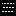
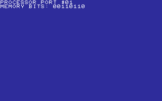
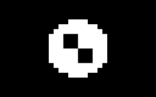
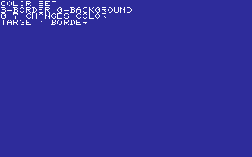
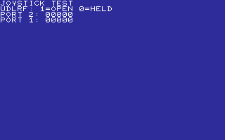
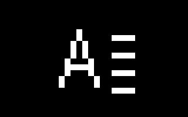
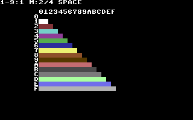
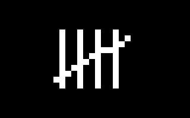

# UTILS

HANDY LITTLE TOOLS.

[All categories](../readme.md) · [Sector 256](../../README.md)

| Icon | Program | Description |
| --- | --- | --- |
|  | [BANKVIEW](#bankview) | DISPLAY THE EIGHT MEMORY-CONFIGURATION BITS IN PORT $01. |
|  | [COINTOSS](#cointoss) | FLIP A RANDOM COIN WITH HEADS AND TAILS TALLIES. |
|  | [COLORSET](#colorset) | SET BORDER OR BACKGROUND COLORS WITH B G AND 0-7. |
|  | [CRTTEST](#crttest) | DISPLAY A CRT CONVERGENCE GRID. |
|  | [JOYTEST](#joytest) | SHOW BOTH JOYSTICK PORTS AS ACTIVE-LOW UDLRF BITS. |
|  | [MAZEGEN](#mazegen) | 190-ROOM PERFECT MAZE. SPACE:NEW. RUN/STOP:RETURN. |
|  | [PALNTSC](#palntsc) | REPORT THE KERNAL PAL OR NTSC VIDEO-STANDARD FLAG. |
|  | [PETSCII](#petscii) | DISPLAY COMMON PETSCII CONTROL AND LETTER CODES. |
|  | [RANDPICK](#randpick) | Picks a fresh random number from one through six. |
|  | [REGVIEW](#regview) | SHOW VIC-II BORDER AND BACKGROUND REGISTERS IN HEX. |
|  | [SCORE](#score) | A TWO-PLAYER SCOREBOARD. A AND L ADD POINTS. |
|  | [SWATCH](#swatch) | ALL 16 COLORS + 120 PAIRS. 1-9:RATE M:MIX SPACE:HOLD STOP:EXIT. |
|  | [TALLY](#tally) | COUNT UP OR DOWN WITH A AND Z. |

---

## BANKVIEW

DISPLAY THE EIGHT MEMORY-CONFIGURATION BITS IN PORT $01.

Stored payload: **86 bytes**.

[Assembly source](BANKVIEW/main.asm)

## COINTOSS

FLIP A RANDOM COIN WITH HEADS AND TAILS TALLIES.

Stored payload: **159 bytes**.

[Assembly source](COINTOSS/main.asm)

## COLORSET

SET BORDER OR BACKGROUND COLORS WITH B G AND 0-7.

Stored payload: **169 bytes**.

[Assembly source](COLORSET/main.asm)

## CRTTEST

DISPLAY A CRT CONVERGENCE GRID.

Stored payload: **206 bytes**.

[Assembly source](CRTTEST/main.asm)

## JOYTEST

SHOW BOTH JOYSTICK PORTS AS ACTIVE-LOW UDLRF BITS.

Stored payload: **149 bytes**.

[Assembly source](JOYTEST/main.asm)

## MAZEGEN

190-ROOM PERFECT MAZE. SPACE:NEW. RUN/STOP:RETURN.

Stored payload: **183 bytes**.

[Assembly source](MAZEGEN/main.asm)

## PALNTSC

REPORT THE KERNAL PAL OR NTSC VIDEO-STANDARD FLAG.

Stored payload: **92 bytes**.

[Assembly source](PALNTSC/main.asm)

## PETSCII

DISPLAY COMMON PETSCII CONTROL AND LETTER CODES.

Stored payload: **102 bytes**.

[Assembly source](PETSCII/main.asm)

## RANDPICK

Picks a fresh random number from one through six.

Stored payload: **71 bytes**.

[Assembly source](RANDPICK/main.asm)

## REGVIEW

SHOW VIC-II BORDER AND BACKGROUND REGISTERS IN HEX.

Stored payload: **120 bytes**.

[Assembly source](REGVIEW/main.asm)

## SCORE

A TWO-PLAYER SCOREBOARD. A AND L ADD POINTS.

Stored payload: **145 bytes**.

[Assembly source](SCORE/main.asm)

## SWATCH

ALL 16 COLORS + 120 PAIRS. 1-9:RATE M:MIX SPACE:HOLD STOP:EXIT.

Stored payload: **256 bytes**.

[Assembly source](SWATCH/main.asm)

## TALLY

COUNT UP OR DOWN WITH A AND Z.

Stored payload: **108 bytes**.

[Assembly source](TALLY/main.asm)

---
**13 programs · 1,846 bytes total · 1482 bytes to spare in this category**

Want to add one? See [Add a program](../../docs/add_program.md)
and the [program interface](../../docs/program-api.md).

Regenerate this page with `python scripts/programs_md.py`.