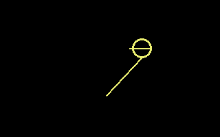
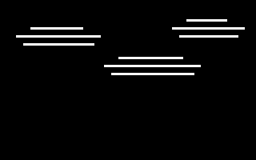
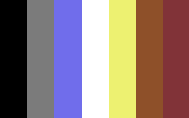
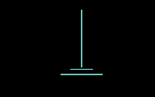
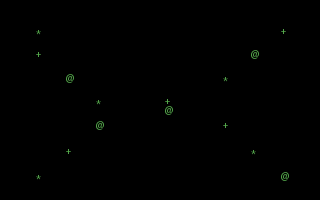
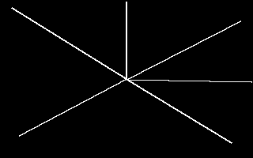

# VISUALS

PIXELS, MOTION, AND VISUAL EFFECTS.

[All categories](../readme.md) · [Sector 256](../../README.md)

| Icon | Program | Description |
| --- | --- | --- |
|  | [ATOM](#atom) | Cycles a single electron around a tiny character-mode atom. |
|  | [BOUNCER](#bouncer) | A BRIGHT BALL BOUNCES AROUND THE BITMAP SCREEN. |
|  | [CITYLGT](#citylgt) | Randomizes a row of glowing windows beneath a tiny city skyline. |
|  | [CLOUDS](#clouds) | THREE LONG CLOUDS DRIFT QUIETLY ACROSS THE SKY. |
|  | [COLORCYC](#colorcyc) | Steps the VIC-II background through all sixteen C64 colors. |
|  | [COMET](#comet) | A DIAGONAL COMET AND ITS TAIL CROSS THE SKY. |
|  | [CREDITS](#credits) | Alternates two compact character-mode credit pages. |
|  | [FADE](#fade) | VIC BORDER AND BACKGROUND COLORS FADE THROUGH RAMPS. |
|  | [FIREFLY](#firefly) | Scatters a fresh random field of blinking fireflies. |
|  | [GLITCH](#glitch) | Generates a new randomized character-corruption field. |
|  | [HEXFLOW](#hexflow) | Generates a fresh random field of hexadecimal digits. |
|  | [HYPNO](#hypno) | Alternates two compact character-ring hypnotic frames. |
|  | [MARQUEE](#marquee) | A tiny character-mode chasing-light marquee. |
|  | [MAZE10](#maze10) | A CLASSIC RANDOM DIAGONAL CHARACTER MAZE. |
|  | [MUNCHING](#munching) | CLASSIC MUNCHING XOR SQUARES WITH A CHANGING PHASE. |
|  | [OCEAN](#ocean) | Alternates two compact character-mode ocean wave scenes. |
|  | [RAIN](#rain) | REPAINT A SPARSE GREEN CHARACTER-RAIN FIELD. |
|  | [RAINDROP](#raindrop) | A FALLING RAIN STREAK ENDS IN A WIDE SPLASH. |
|  | [SCANNER](#scanner) | Steps a bright scanner marker across a character line. |
|  | [SPIRAL](#spiral) | CHANGING PETSCII CHARACTERS WIND TOWARD THE CENTER. |
|  | [STARFLD](#starfld) | RADIANT STAR STREAKS STREAM OUT FROM THE CENTER. |
|  | [TRUCHET](#truchet) | Generates a fresh random field of diagonal character tiles. |
|  | [WORMS](#worms) | Generates a fresh random field of character worm segments. |
|  | [XORPAT](#xorpat) | A CLASSIC X-XOR-Y CHARACTER TEXTURE. |

---

## ATOM

Cycles a single electron around a tiny character-mode atom.

Stored payload: **76 bytes**.

[Assembly source](ATOM/main.asm)

## BOUNCER

A BRIGHT BALL BOUNCES AROUND THE BITMAP SCREEN.

Stored payload: **117 bytes**.

[Assembly source](BOUNCER/main.asm)

## CITYLGT

Randomizes a row of glowing windows beneath a tiny city skyline.

Stored payload: **106 bytes**.

[Assembly source](CITYLGT/main.asm)

## CLOUDS

THREE LONG CLOUDS DRIFT QUIETLY ACROSS THE SKY.

Stored payload: **91 bytes**.

[Assembly source](CLOUDS/main.asm)

## COLORCYC

Steps the VIC-II background through all sixteen C64 colors.

Stored payload: **88 bytes**.

[Assembly source](COLORCYC/main.asm)

## COMET

A DIAGONAL COMET AND ITS TAIL CROSS THE SKY.

Stored payload: **89 bytes**.

[Assembly source](COMET/main.asm)

## CREDITS

Alternates two compact character-mode credit pages.

Stored payload: **188 bytes**.

[Assembly source](CREDITS/main.asm)

## FADE

VIC BORDER AND BACKGROUND COLORS FADE THROUGH RAMPS.

Stored payload: **63 bytes**.

[Assembly source](FADE/main.asm)

## FIREFLY

Scatters a fresh random field of blinking fireflies.

Stored payload: **82 bytes**.

[Assembly source](FIREFLY/main.asm)

## GLITCH

Generates a new randomized character-corruption field.

Stored payload: **71 bytes**.

[Assembly source](GLITCH/main.asm)

## HEXFLOW

Generates a fresh random field of hexadecimal digits.

Stored payload: **93 bytes**.

[Assembly source](HEXFLOW/main.asm)

## HYPNO

Alternates two compact character-ring hypnotic frames.

Stored payload: **199 bytes**.

[Assembly source](HYPNO/main.asm)

## MARQUEE

A tiny character-mode chasing-light marquee.

Stored payload: **137 bytes**.

[Assembly source](MARQUEE/main.asm)

## MAZE10

A CLASSIC RANDOM DIAGONAL CHARACTER MAZE.

Stored payload: **35 bytes**.

[Assembly source](MAZE10/main.asm)

## MUNCHING

CLASSIC MUNCHING XOR SQUARES WITH A CHANGING PHASE.

Stored payload: **49 bytes**.

[Assembly source](MUNCHING/main.asm)

## OCEAN

Alternates two compact character-mode ocean wave scenes.

Stored payload: **196 bytes**.

[Assembly source](OCEAN/main.asm)

## RAIN

REPAINT A SPARSE GREEN CHARACTER-RAIN FIELD.

Stored payload: **72 bytes**.

[Assembly source](RAIN/main.asm)

## RAINDROP

A FALLING RAIN STREAK ENDS IN A WIDE SPLASH.

Stored payload: **92 bytes**.

[Assembly source](RAINDROP/main.asm)

## SCANNER

Steps a bright scanner marker across a character line.

Stored payload: **81 bytes**.

[Assembly source](SCANNER/main.asm)

## SPIRAL

CHANGING PETSCII CHARACTERS WIND TOWARD THE CENTER.

Stored payload: **76 bytes**.

[Assembly source](SPIRAL/main.asm)

## STARFLD

RADIANT STAR STREAKS STREAM OUT FROM THE CENTER.

Stored payload: **43 bytes**.

[Assembly source](STARFLD/main.asm)

## TRUCHET

Generates a fresh random field of diagonal character tiles.

Stored payload: **79 bytes**.

[Assembly source](TRUCHET/main.asm)

## WORMS

Generates a fresh random field of character worm segments.

Stored payload: **77 bytes**.

[Assembly source](WORMS/main.asm)

## XORPAT

A CLASSIC X-XOR-Y CHARACTER TEXTURE.

Stored payload: **45 bytes**.

[Assembly source](XORPAT/main.asm)

---
**24 programs · 2,245 bytes total in this category**

Want to add one? See [Add a program](../../docs/add_program.md)
and the [program interface](../../docs/program-api.md).

Regenerate this page with `python scripts/programs_md.py`.