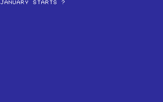
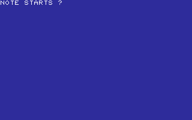
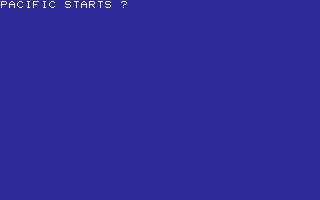
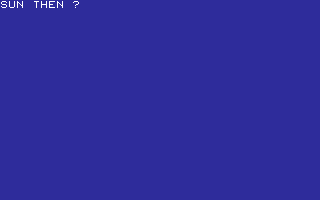
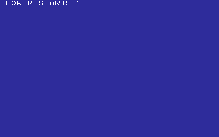

# WORDS

WORDS, LANGUAGE, AND GENERAL KNOWLEDGE.

[All categories](../readme.md) · [Sector 256](../../README.md)

| Icon | Program | Description |
| --- | --- | --- |
|  | [ALPHABET](#alphabet) | FIND THE NEXT LETTER IN THREE SHORT SEQUENCES. |
|  | [ANIMALS](#animals) | PICK THE FIRST LETTER OF THREE ANIMAL NAMES. |
|  | [BODY](#body) | PICK THE FIRST LETTER OF THREE BODY PARTS. |
|  | [DAYS](#days) | PICK THE FIRST LETTER OF THREE WEEKDAY NAMES. |
|  | [DAYSWK](#dayswk) | TYPE THE FIRST LETTER OF THE NEXT WEEKDAY. |
|  | [FAMILY](#family) | PICK THE FIRST LETTER OF THREE FAMILY WORDS. |
|  | [FOOD](#food) | PICK THE FIRST LETTER OF THREE FOOD WORDS. |
|  | [HOME](#home) | PICK THE FIRST LETTER OF THREE HOUSEHOLD WORDS. |
|  | [JOBS](#jobs) | PICK THE FIRST LETTER OF THREE JOB WORDS. |
|  | [LANDMARK](#landmark) | PICK THE FIRST LETTER OF THREE LANDMARK WORDS. |
|  | [MAPS](#maps) | PRACTICE THE FIRST LETTERS OF COMPASS DIRECTIONS. |
|  | [MONTHS](#months) | PICK THE FIRST LETTER OF THREE MONTH NAMES. |
|  | [MUSIC](#music) | PICK THE FIRST LETTER OF THREE MUSIC WORDS. |
|  | [NATURE](#nature) | PICK THE FIRST LETTER OF THREE NATURE WORDS. |
|  | [NUMBERS](#numbers) | PICK THE FIRST LETTER OF THREE NUMBER NAMES. |
|  | [OCEANLIF](#oceanlif) | PICK THE FIRST LETTER OF THREE SEA-LIFE WORDS. |
|  | [OCEANS](#oceans) | PICK THE FIRST LETTER OF THREE OCEAN NAMES. |
|  | [OPPOSITE](#opposite) | PICK THE FIRST LETTER OF THREE OPPOSITE WORDS. |
|  | [PLANETS](#planets) | PICK THE NEXT INNER PLANET INITIAL IN ORDER. |
|  | [PLANTS](#plants) | PICK THE FIRST LETTER OF THREE PLANT WORDS. |
|  | [PLANTS2](#plants2) | PICK THE FIRST LETTER OF THREE MORE PLANT WORDS. |
|  | [RHYMES](#rhymes) | PICK THE FIRST LETTER OF THREE SIMPLE RHYMING WORDS. |
|  | [SCHOOL](#school) | PICK THE FIRST LETTER OF THREE SCHOOL WORDS. |
|  | [SPELLING](#spelling) | FILL IN MISSING LETTERS FOR THREE SHORT WORDS. |

---

## ALPHABET

FIND THE NEXT LETTER IN THREE SHORT SEQUENCES.

Stored payload: **150 bytes**.

[Assembly source](ALPHABET/main.asm)

## ANIMALS

PICK THE FIRST LETTER OF THREE ANIMAL NAMES.

Stored payload: **171 bytes**.

[Assembly source](ANIMALS/main.asm)

## BODY

PICK THE FIRST LETTER OF THREE BODY PARTS.

Stored payload: **168 bytes**.

[Assembly source](BODY/main.asm)

## DAYS

PICK THE FIRST LETTER OF THREE WEEKDAY NAMES.

Stored payload: **180 bytes**.

[Assembly source](DAYS/main.asm)

## DAYSWK

TYPE THE FIRST LETTER OF THE NEXT WEEKDAY.

Stored payload: **197 bytes**.

[Assembly source](DAYSWK/main.asm)

## FAMILY

PICK THE FIRST LETTER OF THREE FAMILY WORDS.

Stored payload: **175 bytes**.

[Assembly source](FAMILY/main.asm)

## FOOD

PICK THE FIRST LETTER OF THREE FOOD WORDS.

Stored payload: **172 bytes**.

[Assembly source](FOOD/main.asm)

## HOME

PICK THE FIRST LETTER OF THREE HOUSEHOLD WORDS.

Stored payload: **172 bytes**.

[Assembly source](HOME/main.asm)

## JOBS

PICK THE FIRST LETTER OF THREE JOB WORDS.

Stored payload: **176 bytes**.

[Assembly source](JOBS/main.asm)

## LANDMARK

PICK THE FIRST LETTER OF THREE LANDMARK WORDS.

Stored payload: **180 bytes**.

[Assembly source](LANDMARK/main.asm)

## MAPS

PRACTICE THE FIRST LETTERS OF COMPASS DIRECTIONS.

Stored payload: **157 bytes**.

[Assembly source](MAPS/main.asm)

## MONTHS

PICK THE FIRST LETTER OF THREE MONTH NAMES.

Stored payload: **180 bytes**.

[Assembly source](MONTHS/main.asm)

## MUSIC

PICK THE FIRST LETTER OF THREE MUSIC WORDS.

Stored payload: **171 bytes**.

[Assembly source](MUSIC/main.asm)

## NATURE

PICK THE FIRST LETTER OF THREE NATURE WORDS.

Stored payload: **174 bytes**.

[Assembly source](NATURE/main.asm)

## NUMBERS

PICK THE FIRST LETTER OF THREE NUMBER NAMES.

Stored payload: **172 bytes**.

[Assembly source](NUMBERS/main.asm)

## OCEANLIF

PICK THE FIRST LETTER OF THREE SEA-LIFE WORDS.

Stored payload: **175 bytes**.

[Assembly source](OCEANLIF/main.asm)

## OCEANS

PICK THE FIRST LETTER OF THREE OCEAN NAMES.

Stored payload: **181 bytes**.

[Assembly source](OCEANS/main.asm)

## OPPOSITE

PICK THE FIRST LETTER OF THREE OPPOSITE WORDS.

Stored payload: **162 bytes**.

[Assembly source](OPPOSITE/main.asm)

## PLANETS

PICK THE NEXT INNER PLANET INITIAL IN ORDER.

Stored payload: **170 bytes**.

[Assembly source](PLANETS/main.asm)

## PLANTS

PICK THE FIRST LETTER OF THREE PLANT WORDS.

Stored payload: **174 bytes**.

[Assembly source](PLANTS/main.asm)

## PLANTS2

PICK THE FIRST LETTER OF THREE MORE PLANT WORDS.

Stored payload: **177 bytes**.

[Assembly source](PLANTS2/main.asm)

## RHYMES

PICK THE FIRST LETTER OF THREE SIMPLE RHYMING WORDS.

Stored payload: **172 bytes**.

[Assembly source](RHYMES/main.asm)

## SCHOOL

PICK THE FIRST LETTER OF THREE SCHOOL WORDS.

Stored payload: **171 bytes**.

[Assembly source](SCHOOL/main.asm)

## SPELLING

FILL IN MISSING LETTERS FOR THREE SHORT WORDS.

Stored payload: **144 bytes**.

[Assembly source](SPELLING/main.asm)

---
**24 programs · 4,121 bytes total · 2023 bytes to spare in this category**

Want to add one? See [Add a program](../../docs/add_program.md)
and the [program interface](../../docs/program-api.md).

Regenerate this page with `python scripts/programs_md.py`.