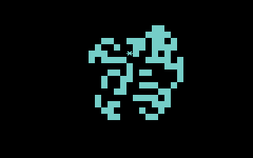
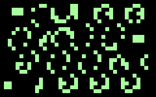

# Sector 256 programs

Every program here runs from the [Sector 256](../README.md) 
Commodore 64 launcher, and each one's stored payload fits in 
**256 bytes or less**. That's one disk block. Press RUN/STOP 
in any program to return to the launcher.

*  [ANT](#ant)
*  [CUBE3D](#cube3d)
*  [DANCE](#dance)
*  [HANGMAN](#hangman)
*  [LIFE](#life)
*  [MAZEGEN](#mazegen)
*  [MONTY](#monty)
*  [RULE30](#rule30)
*  [SNOW](#snow)
*  [SWATCH](#swatch)
*  [TICTACTO](#tictacto)
---
## ANT

LANGTON'S ANT ON 256X200 HIRES. SPACE:RESET. STOP:RETURN.

Category: LAB. Stored payload: **223 bytes**.

[Assembly source](ANT/main.asm)

## CUBE3D

A ROTATING 3D WIREFRAME CUBE.   RUN/STOP TO RETURN TO LAUNCHER.

Category: DEMOS. Stored payload: **238 bytes**.

[Assembly source](CUBE3D/main.asm)

## DANCE

DISCO LADY: FOUR VECTOR DANCE POSES. RUN/STOP TO RETURN.

Category: DEMOS. Stored payload: **249 bytes**.

[Assembly source](DANCE/main.asm)

## HANGMAN

GUESS A SIX-LETTER WORD.         SIX MISSES AND YOU LOSE.

Category: GAMES. Stored payload: **253 bytes**.

[Assembly source](HANGMAN/main.asm)

## LIFE

CONWAY LIFE. SPACE:RANDOMIZE. RUN/STOP:RETURN.

Category: LAB. Stored payload: **243 bytes**.

[Assembly source](LIFE/main.asm)

## MAZEGEN

190-ROOM PERFECT MAZE. SPACE:NEW. RUN/STOP:RETURN.

Category: UTILS. Stored payload: **183 bytes**.

[Assembly source](MAZEGEN/main.asm)

## MONTY

PICK 1-3. MONTY OPENS A GOAT. S:SWITCH K:KEEP. STOP:EXIT.

Category: GAMES. Stored payload: **256 bytes**.

[Assembly source](MONTY/main.asm)

## RULE30

RULE 30 FROM ONE CELL. SPACE:RESET. RUN/STOP:RETURN.

Category: LAB. Stored payload: **220 bytes**.

[Assembly source](RULE30/main.asm)

## SNOW

PIXEL SNOW: BRIGHT FLAKES FALL FAST AND STACK. RUN/STOP:EXIT.

Category: DEMOS. Stored payload: **255 bytes**.

[Assembly source](SNOW/main.asm)

## SWATCH

ALL 16 COLORS + 120 PAIRS. 1-9:RATE M:MIX SPACE:HOLD STOP:EXIT.

Category: UTILS. Stored payload: **256 bytes**.

[Assembly source](SWATCH/main.asm)

## TICTACTO

TWO PLAYERS. KEYS 1-9 PLACE X/O. MAKE A LINE OF THREE.

Category: GAMES. Stored payload: **253 bytes**.

[Assembly source](TICTACTO/main.asm)

---
**11 programs · 2,629 bytes total · 187 bytes to spare across the whole set**

Want to add one? See [Add a program](../docs/add_program.md) 
and the [program interface](../docs/program-api.md). 
The build rejects any payload over 256 bytes.

Regenerate this page with `python scripts/programs_md.py`.