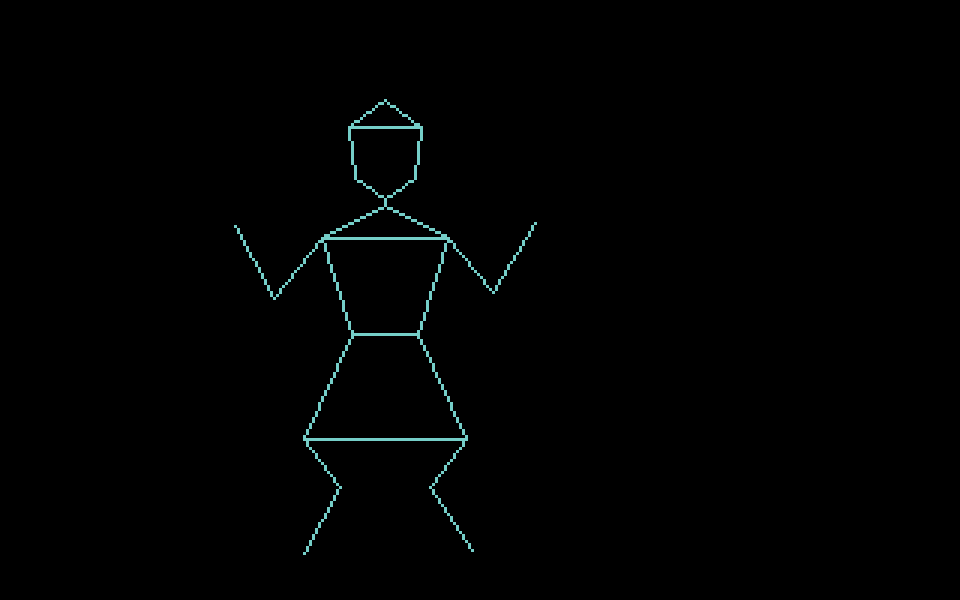
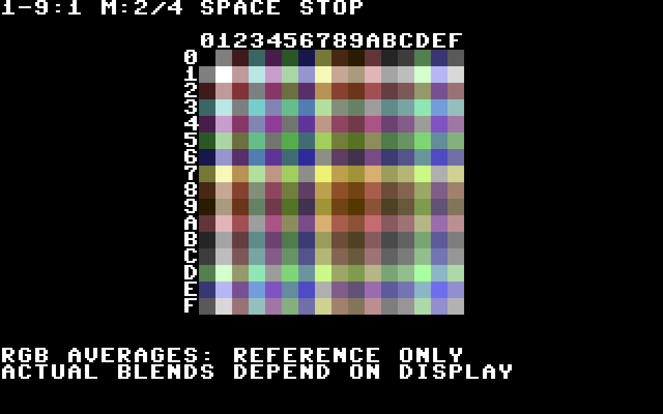

# Sector 256 programs

Generated by `python scripts/programs_md.py`.

## CUBE3D

A ROTATING 3D WIREFRAME CUBE.   RUN/STOP TO RETURN TO LAUNCHER.

Category: DEMOS. Stored payload: **238 bytes**.

[Assembly source](CUBE3D/main.asm)

## DANCE

DISCO LADY: FOUR VECTOR DANCE POSES. RUN/STOP TO RETURN.

Category: DEMOS. Stored payload: **249 bytes**.

[Assembly source](DANCE/main.asm)

## HANGMAN

GUESS A SIX-LETTER WORD.         SIX MISSES AND YOU LOSE.

Category: GAMES. Stored payload: **253 bytes**.

[Assembly source](HANGMAN/main.asm)

## MAZEGEN

190-ROOM PERFECT MAZE. SPACE:NEW. RUN/STOP:RETURN.

Category: UTILS. Stored payload: **183 bytes**.

[Assembly source](MAZEGEN/main.asm)

## SWATCH

ALL 16 COLORS + 120 PAIRS. 1-9:RATE M:MIX SPACE:HOLD STOP:EXIT.

Category: UTILS. Stored payload: **256 bytes**.

[Assembly source](SWATCH/main.asm)

## TICTACTO

TWO PLAYERS. KEYS 1-9 PLACE X/O. MAKE A LINE OF THREE.

Category: GAMES. Stored payload: **253 bytes**.

[Assembly source](TICTACTO/main.asm)

